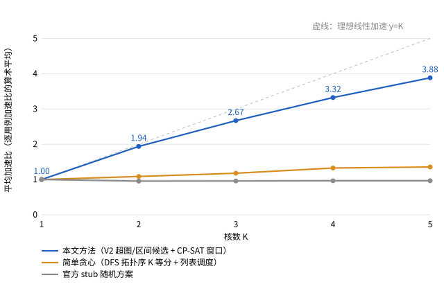

# 2026 研究生数学建模竞赛 A 题 · 问题一（场景 A）求解结果

**一句话结论**：按方案文档“版本二（超图/区间候选 + 局部数学规划）”实现的问题一求解器，对 `data/` 下全部 100 个算例、
K = 2、3、4、5 共 **400 个方案**，全部通过官方评估器 `multicore_cut_evaluate_problem_1.py` 的合法性检查并得到最终指标；
**平均加速比（逐用例加速比的算术平均，题目口径）为 1.939 / 2.670 / 3.324 / 3.884**（K=2/3/4/5，单核定义为 1），
同口径下官方 stub 随机方案为 0.955 / 0.960 / 0.965 / 0.964，简单贪心基线为 1.085 / 1.178 / 1.326 / 1.355。
400 个方案全部优于 stub、全部优于单核基准；新增搬运总量约为 stub 的 1/4（5.35 GB vs 21.57 GB，400 个方案合计）。

| 产出 | 位置 |
|---|---|
| 求解代码（一条命令复现） | `solution_p1/`（入口 `run_all.py`，单算例 `solve_p1.py`） |
| 提交格式结果文件（400 个） | `results_p1/k{2,3,4,5}/case_XXX_multicore_res.json` |
| 官方评估器复核结果与日志 | `results_p1/official_eval/k{K}/case_XXX.json`、`case_XXX_problem_1_log.txt` |
| 结果汇总 | `results_p1/summary.csv`（逐用例×核数）、`results_p1/summary_by_k.csv`（按核数平均） |
| 平均加速比折线图 | `results_p1/speedup_p1.svg` |
| 官方基线（单核 / stub） | `results_p1/baselines/` |
| 求解日志（构造器组合、CP-SAT 窗口统计） | `results_p1/solver_logs/k{K}/case_XXX.json` |
| 验证记录 | `results_p1/validation/`（CP-SAT 对照完整枚举） |


---

## 1. 问题一的输入输出与评分口径（以官方评估器为准）

阅读材料：题目原文 `2026研数模A题.docx`、`数据包/README.md`、`数据包/docs/*.md`，以及评估器源码
`multicore_cut_evaluate_problem_1.py`、`stub_multicore_cut_and_schedule.py`（`derive_multicore_plan`）、
`evaluation_validation.py`、`schedule_step1/2/3.py`、`contest_io.py`、`singlecore_evaluate.py`。

**输入**：计算图 `case_*.json`（`ops/tensors/edges` 二部图）与固定配置 `data/config.txt`
（L1=524288 B、UB=131072 B、DDR 总带宽 60 B/cycle、场景 A：跨核前驱等待 1000 cycles、同核 Task 切换等待 100 cycles）。

**输出（提交格式）**：`<case>_multicore_res.json`，顶层**恰好**两个字段：
- `node_to_subgraph`：键为全部非 `COPY_IN/COPY_OUT` 操作 id 的十进制字符串，值为非负整数 sgid；必须恰好覆盖；
- `core_schedules`：长度 = 核数 K 的二维数组，第 c 行是核 c 上的 sgid 执行顺序，可以为空；每个 sgid 恰好出现一次。

**合法性**（`derive_multicore_plan` + `validate_task_order`）：覆盖无重无漏；子图依赖图（跨过 COPY 节点收缩后的
计算 op 依赖投影到子图）无环；同核顺序不违反依赖；“数据依赖 + 同核 Task 顺序”的组合图无环。

**评分语义（问题一，场景 A）**：
1. 每个子图是一个 Task。Task 内：对每个被本 Task 消费但不由本 Task 生产的张量插入 `COPY_IN`（从 DDR），对本 Task
   生产且有 Task 外消费者 / 是图最终输出 / 无计算消费者的张量插入 `COPY_OUT`。原图的 COPY 节点不进入 Task。
2. 每个 Task 独立执行官方核内三步：Step1 反向 DFS 拓扑序 → Step2 Belady 换入换出（spill）→ Step3 多 Pipe 排布，
   得到固定的逐 Pipe 发射顺序与内存复用补边。
3. 多核事件仿真：Task 在 **全部前驱 Task 完成** 且 **同核上一个 Task 结束 + 100**、**每个跨核前驱结束 + 1000**
   之后激活；四条 Pipe 各自串行；所有核心的 DDR 搬运按公平共享 60 B/cycle 结算（剩余工作量以独占周期计，结束时刻
   向上取整）。
4. **Makespan** = 所有 Task 结束时刻的最大值（主指标）；**新增搬运量** `added_copy_bytes` = 全部 Task 边界 COPY
   字节 − 原图 COPY 字节 + Step2 换入换出字节（次指标）。
5. **单核基准**：`singlecore_evaluate.py` 把整图作为一个子图放在核 0，用同一场景 A 评估器计算；
   K 核加速比 = 单核基准 / K 核 Makespan；平均加速比 = 逐用例加速比的算术平均（题目脚注 2）。

## 2. 方案文档与官方评估器的差异记录（以评估器为准）

| # | 方案文档（版本二）中的表述 | 官方评估器的实际语义 / 本实现的处理 |
|---|---|---|
| 1 | 规划层：Task 时长 `d_g` 为固定代理，跨核依赖 `S_h ≥ F_g + 1000` | 评估器中 Task 只有在**全部**前驱 Task 完成后才整体激活，且 Task 内的 COPY_IN/计算/COPY_OUT 的实际时长受全局 DDR 争用影响。本实现的 `d_g` 取官方 Step1-3 的**独占带宽局部 makespan × 当前方案实测争用系数**，并对每个 CP-SAT 解做完整精确回放后才接受。 |
| 2 | 1.3 节通信代理 `b_t[1(|R|>0)+|R|]`、重复读取 `b_t(n-1)` | 与评估器一致：边界张量在生产 Task 只 COPY_OUT 一次，每个消费 Task 各 COPY_IN 一次；原始输入被 n 个 Task 读取时新增 (n−1)·b_t。但评估器还额外计入：**无计算消费者的死输出也必须 COPY_OUT**，以及 **Step2 的 spill 流量**（首次换出写回 + 每次换入；由原 COPY_IN 产生的张量换出时不写回，只重复读取）。本实现直接用官方 Step1-3 结果计入，不再使用代理公式打分。 |
| 3 | 1.5 节“内存驻留变量/峰值代理” | 场景 A 中每个 Task 的内存由官方 Step2/3 在 Task 内部独立处理，多核仿真不再跟踪 L1/UB；外层只能通过“子图包含哪些 op”间接影响 spill。因此内存完全交给缓存的官方 Step1-3 结果，不另建驻留代理。 |
| 4 | 2.1.1 节用拓扑秩 `r_h ≥ r_g + 1 − M(2−a_g−a_h)` 保证商图无环 | 官方检查的是“子图依赖 + 同核顺序”的组合图无环。本实现在窗口内对被选候选施加**时间先行**约束（`S_h ≥ F_g` / `F_g+1000`，时长为正），它蕴含秩约束；并证明窗口外 Task 不会形成“离开窗口再返回”的路径（证明见 `window_cpsat.py` 模块说明），故解码方案一定通过官方 DAG 与顺序检查（400 个最终方案全部实测通过）。 |
| 5 | “同核相邻 Task 100 cycles” | 评估器中 100 cycles 是相对**同核上一个 Task 的结束**，与是否存在依赖无关；跨核等待 1000 是相对**每个**跨核前驱 Task 的结束。CP-SAT 中用长度 `d_g+100` 的可选区间 + `NoOverlap` 表达前者，用条件先行约束表达后者。 |
| 6 | `core_schedules` 的核数 | 评估器令 `num_cores = len(core_schedules)`，允许空列表。本实现总是输出恰好 K 行；K 核方案若不如 K−1 核方案，则沿用后者并补一个空行（仿真结果不变）。 |
| 7 | 方案文档称 Step3 时间“不作为最终 makespan” | 一致。但 Step3 确定的**逐 Pipe 顺序**被多核仿真原样沿用，外层算法无法改变 Task 内部顺序（Step1 反向 DFS 以分量为主序），这是“整分量打包”在共享权重图上反复 spill 的根源（见第 6 节）。 |
| 8 | 文档伪代码 `official_evaluate` 每次调用官方评估器 | 官方评估器每个事件都遍历整个 Task 的全部 op（`retire` 中的 `all(...)` 与列表构造），对大 Task 是 O(n²)，单核评估 case_014 需 ~340 s。搜索阶段改用与官方**逐项一致**的快速精确评估器（第 3.1 节，已对照验证），官方评估器只用于最终复核。 |
| 9 | 文档 3.6 节“相同评价次数 / 相同时间”的比较口径 | 本实现所有阶段均以墙钟时间预算控制（40 s + 计算节点数/100 s，上限 300 s），CP-SAT 也有时间上限，因此不同机器/负载下结果可能有细微差异（非位级复现）。 |

## 3. 方法概述（方案文档版本二·问题一的实现）

决策变量：`P = (π, κ, σ)`——计算 op → 子图（`node_to_subgraph`）、子图 → 核、每核子图顺序（`core_schedules`）。

```
V2_A(G, K, budget):
    model  = GraphModel(G)                      # 计算 DAG（跨 COPY 收缩）、张量生产/消费超边
    cands  = portfolio_constructors(model, K)   # 五类构造器 × 参数网格，全部是已知可行方案
    best   = argmin_exact(cands)                # 快速精确评估器打分（与官方一致）
    while budget_remains:                       # 关键窗口局部数学规划
        W      = choose_critical_window(best)   # 关键 Task 链上的时间窗
        family = generate_candidate_subgraphs(W)   # 微块 + 连续区间 + 合并/边界平移，凸性检查
        plan   = CP-SAT(exact_cover + assignment + interval/NoOverlap + precedence, hint=best)
        keep_if_lex_better(exact_eval(plan))    # (Makespan, 新增搬运) 字典序
    return best
```

### 3.1 快速精确评估器（`fast_eval.py`）
- **Task 构造**逐行复刻 `_build_scene_a_tasks`（触及张量排序、边界 COPY 插入、DDR→UB 改写、边顺序），然后**直接调用
  官方** `step1_schedule / step2_spill_insertion / _build_extended_graph / prepare_step3_execution`。Task 结果只取决于子图的
  op 集合，按 `frozenset` 缓存，搜索中反复复用。边界节点新 id 与官方全局分配只差一个保持大小关系的单调重编号，
  官方三步只依赖 id 相对大小，因此结果不变。
- **事件仿真**逐行复刻官方循环（退休→激活→发射→推进，DDR 公平共享的浮点结算与取整完全照搬），只把 O(n) 的
  “Task 是否全部完成”扫描换成计数器。

### 3.2 初始可行方案：五类构造器组合（`construct.py`）
| 构造器 | 思路 | 擅长的图 |
|---|---|---|
| `comp-pack/d` 分量打包 | 弱连通分量间无依赖；按“共享输入字节最多”贪心把分量串起来（共享输入 = 超边，同一 Task 只读一次），负载达 `W/(K·d)` 切 Task；Task 相互独立，LPT 按官方局部 makespan 分核 | 大量同构分支（case_014/072/076/091 等） |
| `band/n×p` 层带区间 | ASAP 深度均分 n 个带，排序键（带号, DFS 位置）是拓扑序；带内按负载连续切 p 块，列表调度分核 | 多分支逐层共享权重、整分量打包会反复 spill 的图（case_044/046/006） |
| `interval-dfs/d` 拓扑区间 | 反向 DFS 拓扑序切成负载约 `W/(K·d)` 的连续区间，Task 级列表调度（区间顺序即合法拓扑序）| 通用基线；d=1 即本文的“简单贪心基线” |
| `tals-*` 场景 A 感知列表调度 | 按拓扑序逐个放 op：每个核上比较“并入当前打开的 Task”与“关闭后新开 Task”，估计 100/1000 等待、边界 COPY_IN/OUT（MTE2/MTE3 串行）、M/V Pipe 占用，取预计完成最早者；新开 Task 附加碎片惩罚 `ob·(1+被迫关闭的前驱 Task 数)` | 深而窄、需要细粒度跨核流水的图（case_003/064/069 等） |
| `heft-cut/P` | op 级 HEFT（跨核附加惩罚 P）+ 同步点切分：跨核依赖出现时关闭生产端 Task；若消费端 Task 尚未依赖它也同时关闭 | 长链式 Vector 图（case_016/051） |

所有构造器生成的方案都满足官方合法性：区间类方案的商图边只指向后面的区间；TALS/HEFT 切分按“Task 关闭时刻”
排序即为商图拓扑序（一条跨 Task 边 X→Y 被加入时 X 已关闭而 Y 仍打开，故 close(X) < close(Y)）。

### 3.3 关键窗口 CP-SAT 局部规划（`window_cpsat.py`）
- **窗口**：沿精确仿真的关键 Task 链（反向追踪决定开始时刻的“同核上一 Task+100 / 跨核前驱+1000”约束）取锚点，
  窗口 W = 开始时刻落在 [t0, t1) 的约 16 个 Task。
- **候选族**：W 内每个 Task 沿 DFS 拓扑序切成 ≤3 个微块；候选 = 每个 Task 的全部连续微块区间（含原 Task 与单微块）
  + 同核相邻/有依赖 Task 对的合并及“尾块+后继”“前驱+首块”边界平移 + 同核连续三元组合并；合并候选检查凸性。
- **模型**（对应文档 2.1.1 三层）：
  - 精确覆盖：`Σ_{g∋b} a_g = 1`（每个微块 b）；
  - 分核：`Σ_k x_gk = a_g`，`x_gk` 控制可选区间 `[S_g, F_g+100)`，每核 `NoOverlap`；
  - 时间代理：`F_g = S_g + d_g`，`d_g = round(局部makespan_g × ρ)`，ρ = 窗口内 Task 实测时长 / 局部 makespan；
  - 先行：依赖 g→h 同核 `S_h ≥ F_g`（叠加 NoOverlap 即 +100），跨核 `S_h ≥ F_g + 1000`；
  - 窗口外固定：核 k 在 t0 前最后一个 Task 的结束 +100、窗口外前驱结束（跨核 +1000）给出释放时刻；窗口外后继的
    剩余长度（Makespan − 其开始时刻 + 1000）与各核窗口后首个 Task 的剩余长度给出尾部项；
  - 目标：`min Z + μ Σ a_g·bytes_g/60`，`Z ≥ F_g + tail_g`，μ = 0.2。以当前方案为 hint，单次求解 ≤ 3 s。
- **解码与接受**：窗口前 Task 保持原序，窗口内按 `S_g` 排序，窗口后 Task 保持原序；完整精确回放，按
  (Makespan, 新增搬运) 字典序严格变好才接受。规划时刻不写入输出。

### 3.4 其他
- **时间预算**：单个 (算例, K) 为 `min(300, 40 + 计算节点数/100)` 秒；构造阶段 ≤ 45%，其余给 CP-SAT 窗口。最大算例
  case_014（38666 个节点）单次 ≤ 301 s，满足题目“5~10 分钟内”的建议。
- **核数单调性后处理**：K 核结果若劣于 K−1 核，则沿用 K−1 核方案并补空核心。

## 4. 正确性验证

1. **快速评估器 = 官方评估器**：`solution_p1/verify_fast_eval.py` 对 5 个算例 × 5 组官方 stub 随机方案（K=1~5、
   子图规模 5~300）逐项比较 Makespan、新增搬运量和**每个 Task 的结束时刻**，25/25 完全一致；此外 400 个最终方案的
   快速评估值与官方评估器输出也 **400/400 完全一致**（`summary.csv` 的 `fast_eval_match` 列）。
2. **所有最终方案官方合法**：400 个方案全部由官方命令行评估成功（非零退出码会记为失败，实际失败 0 个）。
3. **CP-SAT 模型编码与建模误差（文档 2.1.3）**：`solution_p1/verify_cpsat_enum.py` 在 case_064、K=2 的 4 个小窗口
   （3 个 Task、4~6 个微块、9~13 个候选）上完整枚举同一候选族的全部“精确覆盖 × 分核 × 核内顺序”
   （150~2750 个离散方案），结果写入 `validation/cpsat_enumeration_case_064_k2.json`：

   | 窗口 | 微块/候选 | 枚举方案数 | 枚举代理最优 | CP-SAT 目标（状态） | 编码一致 | 全部方案真实最优 | 代理最优方案的真实值 | CP-SAT 方案真实值 | 代理-真实 Spearman |
   |---|---|---|---|---|---|---|---|---|---|
   | 1 | 5 / 13 | 272 | 17955 | 17955 (OPTIMAL) | 是 | 17937 | 17937 | 17937 | 0.996 |
   | 2 | 6 / 12 | 2750 | 18980 | 18980 (OPTIMAL) | 是 | 18050 | 18050 | 18050 | 0.885 |
   | 3 | 4 / 9 | 150 | 18731 | 18731 (OPTIMAL) | 是 | 18050 | 18050 | 18050 | 1.000 |
   | 4 | 5 / 9 | 586 | 19067 | 19067 (OPTIMAL) | 是 | 18050 | 18466 | 18050 | 0.850 |

   四个窗口 CP-SAT 最优值都等于枚举最优值（模型编码正确）；在这些**已穷尽**的有限候选集上，全部离散方案都做了
   精确回放。窗口 4 说明代理最优并不保证真实最优（按代理排序第一的方案真实慢 2.3%），这正是本实现对每个规划解
   都做完整回放、只接受真实改进的原因。以上“最优”仅指该有限候选族/代理模型，不是原问题的全局最优证书。

## 5. 结果

### 5.1 平均加速比（题目要求的 1~5 核折线图数据）



| 核数 K | 用例数 | 本文平均加速比 | 简单贪心平均加速比 | stub 平均加速比 | 平均新增搬运 (B) | 全部官方合法 |
|---|---|---|---|---|---|---|
| 1 | 100 | 1.000 | 1.000 | 1.000 | 0 | True |
| 2 | 100 | 1.939 | 1.085 | 0.955 | 10,685,696 | True |
| 3 | 100 | 2.670 | 1.178 | 0.960 | 13,154,545 | True |
| 4 | 100 | 3.324 | 1.326 | 0.965 | 13,551,575 | True |
| 5 | 100 | 3.884 | 1.355 | 0.964 | 16,101,632 | True |

说明：K=1 按题目定义记为 1；“简单贪心”= 反向 DFS 拓扑序切成 K 段负载相等的连续区间 + Task 级列表调度
（`interval-dfs/1`，由 `run_greedy_baseline.py` 对全部 400 个 (算例, K) 生成，方案存于 `baselines/greedy_k{K}/`，
用与官方逐项一致的快速评估器打分）；stub = 官方随机示例生成器（seed=0）+ 官方问题一评估器。

### 5.2 与基线的逐核对比

| 核数 K | 优于 stub | 优于简单贪心（严格） | 优于单核 | 加速比中位数 | 最小加速比（用例） | 最大加速比（用例） |
|---|---|---|---|---|---|---|
| 2 | 100/100 | 97/100 | 100/100 | 1.990 | 1.077 (case_064) | 3.647 (case_084) |
| 3 | 100/100 | 97/100 | 100/100 | 2.878 | 1.408 (case_064) | 4.312 (case_008) |
| 4 | 100/100 | 96/100 | 100/100 | 3.669 | 1.565 (case_064) | 6.368 (case_084) |
| 5 | 100/100 | 97/100 | 100/100 | 4.278 | 1.614 (case_064) | 6.368 (case_084) |

- 400/400 优于 stub、400/400 优于单核基准；对简单贪心 387/400 严格更优，其余 13 个持平、0 个更差
  （持平的用例由相互独立的同构分支组成，K 等分拓扑区间与 K 份分量打包是同一方案，例如 case_001、case_037）。
- **超线性加速**：87 个 (算例, K) 的加速比大于 K，例如 case_084（K=4：6.37）、case_095（K=2：3.63）、case_059（K=5：5.50）。
  原因与题目脚注 3 一致：单核基准是整图一个 Task 的启发式核内调度，大 Task 会产生大量 spill（如 case_014 单核
  spill 71 MB），而多核方案的 Task 更小、驻留更少、COPY 与计算流水更充分。
- **较弱的用例**（K=5 加速比 < 2）：case_064、case_044、case_071、case_016、case_024、case_051、case_048、case_005。
  这些图要么是深而窄的依赖链（case_016/024/051：12 路车道每 ~8 层全归约同步一次，单个同步区间只有几千 cycles 的
  并行工作，而每次跨核同步至少 1000 cycles 等待 + 边界 COPY），要么是强共享权重导致 DDR 带宽受限（case_044）。
  LB0 = max(W_M/K, W_V/K, CP) 不含同步与搬运代价，对这类图明显偏松；全部 400 个方案的平均 Makespan/LB0 = 1.55。

### 5.3 消融：构造器组合与 CP-SAT 窗口阶段

| 最终被选中的初始构造器 | 次数（/400） |
|---|---|
| comp-pack（分量打包 / 共享输入超边聚合） | 231 |
| tals-dfs / tals-bl / tals-level（场景 A 感知列表调度） | 104 / 9 / 3 |
| band（层带区间） | 27 |
| heft-cut（op 级 HEFT + 同步点切分） | 25 |
| interval-dfs（拓扑区间） | 1 |

- CP-SAT 窗口阶段共求解 5096 个窗口模型（OPTIMAL 742、FEASIBLE 4335、UNKNOWN 15、INFEASIBLE 0），其中 1139 个解
  经精确回放被接受；381 个非继承方案中有 254 个被窗口阶段改进，平均改进 1.45%，最大 12.4%。
  窗口阶段的收益明显小于构造阶段：构造器组合决定了 Task 粒度与分核的大格局，而固定窗口外时间的代理模型只能做
  局部的合并/拆分/换核/重排（见 6.3）。
- 19 个 (算例, K) 的 K 核结果不如 K−1 核（例如 case_006 K=4/5），按 3.4 节沿用 K−1 核方案并补空核心；
  `summary.csv` 的 `inherited_from_cores` 列标注了来源。
- 运行时间：单个 (算例, K) 平均 74 s、最长 302 s（case_014、072 等最大算例）；官方评估器复核单个方案最长 123 s。

### 5.4 逐用例结果（官方评估器输出；Makespan 单位 cycles，新增搬运单位字节）

完整字段（含 `partition_added_bytes`、`spill_added_bytes`、子图数、LB0、stub/贪心、求解时间等）见 `summary.csv`。

| 用例 | 单核基准 | K=2 Makespan / 新增搬运 | K=3 Makespan / 新增搬运 | K=4 Makespan / 新增搬运 | K=5 Makespan / 新增搬运 | K=2..5 加速比 | stub K=4 | 贪心 K=4 |
|---|---|---|---|---|---|---|---|---|
| case_001 | 233,110 | 116,868 / 1,152 | 78,545 / 2,304 | 58,984 / 3,456 | 47,502 / 4,608 | 1.99/2.97/3.95/4.91 | 256,220 | 58,984 |
| case_002 | 261,945 | 136,357 / 5,614,080 | 97,360 / 857,088 | 74,247 / 761,856 | 62,955 / 500,736 | 1.92/2.69/3.53/4.16 | 269,157 | 263,005 |
| case_003 | 602,212 | 370,859 / 6,737,114 | 281,467 / 7,240,138 | 235,708 / 7,043,394 | 222,886 / 7,738,016 | 1.62/2.14/2.55/2.70 | 767,410 | 609,334 |
| case_004 | 392,357 | 199,074 / 110,592 | 134,043 / 221,184 | 104,188 / 331,776 | 88,497 / 442,368 | 1.97/2.93/3.77/4.43 | 413,867 | 297,188 |
| case_005 | 95,618 | 72,981 / 1,374,260 | 54,105 / 1,428,886 | 50,203 / 1,956,274 | 50,203 / 1,956,274 | 1.31/1.77/1.90/1.90 | 155,676 | 98,930 |
| case_006 | 82,837 | 43,057 / 61,960 | 31,151 / 3,456 | 31,151 / 3,456 | 31,151 / 3,456 | 1.92/2.66/2.66/2.66 | 89,212 | 82,839 |
| case_007 | 1,012,562 | 507,494 / 27,648 | 338,094 / 55,296 | 254,398 / 82,944 | 203,834 / 110,592 | 2.00/2.99/3.98/4.97 | 1,024,194 | 258,414 |
| case_008 | 487,605 | 137,478 / 3,981,312 | 113,080 / 3,981,312 | 112,880 / 3,981,312 | 100,603 / 0 | 3.55/4.31/4.32/4.85 | 443,533 | 123,060 |
| case_009 | 153,261 | 92,198 / 0 | 84,543 / 1,212,204 | 75,726 / 1,384,372 | 70,899 / 1,627,082 | 1.66/1.81/2.02/2.16 | 218,513 | 152,474 |
| case_010 | 86,969 | 42,513 / 795,296 | 32,578 / 180,864 | 29,611 / 65,664 | 29,611 / 65,664 | 2.05/2.67/2.94/2.94 | 88,416 | 89,234 |
| case_011 | 184,697 | 92,646 / 180,224 | 62,631 / 903,168 | 46,880 / 540,672 | 46,880 / 540,672 | 1.99/2.95/3.94/3.94 | 186,292 | 46,880 |
| case_012 | 59,088 | 30,606 / 25,920 | 21,158 / 9,216 | 16,613 / 40,914 | 13,794 / 58,200 | 1.93/2.79/3.56/4.28 | 70,260 | 58,033 |
| case_013 | 263,949 | 132,198 / 8,192 | 88,351 / 16,384 | 67,017 / 24,576 | 54,468 / 32,768 | 2.00/2.99/3.94/4.85 | 289,265 | 198,158 |
| case_014 | 17,698,626 | 8,761,285 / 60,478,368 | 5,853,188 / 67,243,840 | 4,407,313 / 56,332,960 | 3,523,383 / 55,237,536 | 2.02/3.02/4.02/5.02 | 11,866,986 | 17,651,473 |
| case_015 | 177,362 | 90,201 / 180,240 | 59,585 / 623,808 | 48,350 / 835,968 | 39,096 / 379,090 | 1.97/2.98/3.67/4.54 | 189,197 | 173,551 |
| case_016 | 7,715,523 | 5,927,539 / 178,804,716 | 5,174,542 / 178,941,220 | 4,463,893 / 179,071,776 | 4,206,296 / 179,072,372 | 1.30/1.49/1.73/1.83 | 8,151,977 | 7,718,620 |
| case_017 | 162,810 | 78,762 / 82,944 | 54,715 / 194,304 | 39,206 / 349,728 | 37,554 / 858,868 | 2.07/2.98/4.15/4.34 | 165,542 | 116,456 |
| case_018 | 1,004,367 | 498,667 / 3,612,676 | 338,555 / 1,822,720 | 251,377 / 4,173,184 | 203,149 / 2,555,904 | 2.01/2.97/4.00/4.94 | 964,266 | 1,002,589 |
| case_019 | 81,144 | 40,818 / 49,152 | 28,030 / 187,680 | 24,099 / 49,152 | 19,714 / 157,716 | 1.99/2.89/3.37/4.12 | 81,369 | 81,030 |
| case_020 | 532,746 | 266,580 / 0 | 177,950 / 0 | 133,704 / 0 | 107,726 / 0 | 2.00/2.99/3.98/4.95 | 1,121,776 | 533,698 |
| case_021 | 6,567,937 | 3,109,260 / 8,294,400 | 2,108,970 / 10,768,384 | 1,555,545 / 7,936,000 | 1,243,902 / 7,372,800 | 2.11/3.11/4.22/5.28 | 5,072,278 | 6,483,225 |
| case_022 | 56,780 | 28,961 / 0 | 20,053 / 109,206 | 14,918 / 0 | 12,161 / 13,824 | 1.96/2.83/3.81/4.67 | 71,908 | 57,306 |
| case_023 | 122,614 | 62,929 / 181,208 | 39,337 / 947,388 | 33,997 / 546,286 | 26,562 / 379,012 | 1.95/3.12/3.61/4.62 | 116,466 | 119,588 |
| case_024 | 2,555,343 | 1,951,984 / 58,596,620 | 1,704,264 / 58,598,376 | 1,474,020 / 58,729,346 | 1,389,719 / 58,795,048 | 1.31/1.50/1.73/1.84 | 2,707,888 | 2,559,035 |
| case_025 | 4,863,026 | 2,431,840 / 27,648 | 1,622,164 / 55,296 | 1,217,470 / 82,944 | 975,360 / 110,592 | 2.00/3.00/3.99/4.99 | 4,292,738 | 4,865,060 |
| case_026 | 99,203 | 52,762 / 193,048 | 42,442 / 94,080 | 42,442 / 94,080 | 39,848 / 261,036 | 1.88/2.34/2.34/2.49 | 109,697 | 98,857 |
| case_027 | 2,363,952 | 1,116,984 / 2,211,840 | 830,910 / 24,918,016 | 559,196 / 2,211,840 | 559,196 / 2,211,840 | 2.12/2.85/4.23/4.23 | 1,739,293 | 559,196 |
| case_028 | 43,836,040 | 21,764,618 / 76,515,912 | 15,395,381 / 87,954,000 | 12,541,072 / 90,149,928 | 10,109,465 / 324,098,928 | 2.01/2.85/3.50/4.34 | 40,252,127 | 13,587,037 |
| case_029 | 37,555 | 19,740 / 0 | 12,743 / 0 | 11,098 / 0 | 9,488 / 0 | 1.90/2.95/3.38/3.96 | 46,229 | 38,237 |
| case_030 | 2,808,034 | 1,403,531 / 2,580,480 | 938,568 / 4,349,952 | 707,133 / 2,580,480 | 564,152 / 2,258,944 | 2.00/2.99/3.97/4.98 | 2,590,493 | 2,801,496 |
| case_031 | 1,414,369 | 708,600 / 3,173,376 | 470,731 / 5,729,792 | 355,389 / 4,237,348 | 282,077 / 5,245,440 | 2.00/3.00/3.98/5.01 | 1,367,250 | 1,390,978 |
| case_032 | 41,443 | 20,428 / 6,144 | 14,438 / 23,568 | 11,295 / 24,584 | 10,517 / 30,720 | 2.03/2.87/3.67/3.94 | 47,681 | 37,435 |
| case_033 | 1,774,196 | 882,972 / 5,415,936 | 589,845 / 5,772,304 | 442,430 / 5,415,936 | 358,218 / 4,704,768 | 2.01/3.01/4.01/4.95 | 1,736,141 | 1,767,568 |
| case_034 | 842,996 | 428,357 / 3,448,840 | 279,660 / 3,152,904 | 212,759 / 2,270,208 | 172,575 / 3,902,976 | 1.97/3.01/3.96/4.88 | 956,573 | 826,415 |
| case_035 | 169,571 | 95,406 / 0 | 95,406 / 0 | 89,670 / 1,146,902 | 74,280 / 1,072,650 | 1.78/1.78/1.89/2.28 | 220,672 | 171,174 |
| case_036 | 931,510 | 466,068 / 1,152 | 311,345 / 2,304 | 233,584 / 3,456 | 187,182 / 4,608 | 2.00/2.99/3.99/4.98 | 1,030,229 | 240,978 |
| case_037 | 210,001 | 105,374 / 204,800 | 74,038 / 491,520 | 53,320 / 614,400 | 43,013 / 819,200 | 1.99/2.84/3.94/4.88 | 243,331 | 53,320 |
| case_038 | 1,364,555 | 671,633 / 6,901,248 | 456,035 / 3,649,536 | 342,300 / 8,024,064 | 275,545 / 6,321,664 | 2.03/2.99/3.99/4.95 | 1,441,465 | 1,353,545 |
| case_039 | 1,435,262 | 696,914 / 12,148,736 | 475,844 / 10,604,544 | 391,944 / 9,232,384 | 316,542 / 9,805,824 | 2.06/3.02/3.66/4.53 | 1,463,231 | 1,425,644 |
| case_040 | 253,454 | 130,528 / 36,864 | 110,105 / 0 | 110,105 / 0 | 110,105 / 0 | 1.94/2.30/2.30/2.30 | 297,785 | 246,707 |
| case_041 | 6,003,957 | 2,969,043 / 24,426,496 | 1,986,182 / 27,620,352 | 1,500,761 / 15,433,728 | 1,193,899 / 19,200,004 | 2.02/3.02/4.00/5.03 | 4,636,634 | 5,941,210 |
| case_042 | 1,686,740 | 836,687 / 3,753,984 | 552,854 / 4,617,216 | 418,795 / 3,753,984 | 339,578 / 4,184,064 | 2.02/3.05/4.03/4.97 | 1,399,638 | 1,661,528 |
| case_043 | 677,656 | 342,489 / 1,030,144 | 271,072 / 279,560 | 271,072 / 279,560 | 263,773 / 8,961,944 | 1.98/2.50/2.50/2.57 | 825,916 | 681,521 |
| case_044 | 154,407 | 90,788 / 1,077,920 | 90,788 / 1,077,920 | 90,788 / 1,077,920 | 90,788 / 1,077,920 | 1.70/1.70/1.70/1.70 | 137,207 | 162,745 |
| case_045 | 125,614 | 63,059 / 0 | 42,304 / 0 | 32,037 / 0 | 26,330 / 0 | 1.99/2.97/3.92/4.77 | 213,195 | 126,690 |
| case_046 | 276,455 | 135,950 / 1,200,736 | 135,950 / 1,200,736 | 106,198 / 3,061,536 | 106,198 / 3,061,536 | 2.03/2.03/2.60/2.60 | 250,113 | 124,612 |
| case_047 | 326,508 | 228,888 / 2,505,770 | 152,637 / 2,791,236 | 148,685 / 3,411,506 | 128,972 / 3,143,382 | 1.43/2.14/2.20/2.53 | 464,110 | 328,731 |
| case_048 | 222,220 | 163,381 / 1,136,990 | 129,515 / 1,159,680 | 119,990 / 1,232,200 | 117,281 / 1,446,458 | 1.36/1.72/1.85/1.89 | 244,749 | 224,788 |
| case_049 | 196,276 | 121,320 / 1,006,668 | 95,205 / 1,394,368 | 81,727 / 1,346,092 | 73,366 / 1,386,064 | 1.62/2.06/2.40/2.68 | 250,036 | 199,566 |
| case_050 | 149,690 | 99,247 / 1,001,482 | 69,460 / 977,880 | 62,707 / 1,064,928 | 57,137 / 1,125,538 | 1.51/2.16/2.39/2.62 | 203,869 | 150,067 |
| case_051 | 607,628 | 450,139 / 13,108,922 | 395,518 / 13,240,390 | 345,200 / 13,371,492 | 326,580 / 13,502,606 | 1.35/1.54/1.76/1.86 | 645,287 | 609,575 |
| case_052 | 180,301 | 91,999 / 149,760 | 61,886 / 78,336 | 48,176 / 177,408 | 39,289 / 227,328 | 1.96/2.91/3.74/4.59 | 185,614 | 135,381 |
| case_053 | 1,472,686 | 707,964 / 10,528,256 | 491,765 / 10,577,408 | 491,765 / 10,577,408 | 410,881 / 13,812,690 | 2.08/2.99/2.99/3.58 | 1,520,068 | 1,470,632 |
| case_054 | 815,051 | 499,011 / 6,012,542 | 370,287 / 6,591,188 | 302,634 / 6,778,160 | 270,530 / 7,080,320 | 1.63/2.20/2.69/3.01 | 1,014,223 | 817,505 |
| case_055 | 118,835 | 61,132 / 16,384 | 41,834 / 80,384 | 31,970 / 98,828 | 28,199 / 247,808 | 1.94/2.84/3.72/4.21 | 118,819 | 112,235 |
| case_056 | 277,285 | 171,985 / 1,709,602 | 142,599 / 2,148,142 | 124,393 / 2,117,848 | 103,976 / 2,327,268 | 1.61/1.94/2.23/2.67 | 384,947 | 281,082 |
| case_057 | 59,726 | 29,970 / 4,096 | 21,014 / 14,976 | 16,026 / 55,176 | 14,276 / 0 | 1.99/2.84/3.73/4.18 | 65,516 | 60,034 |
| case_058 | 4,539,717 | 2,199,011 / 42,680,320 | 1,526,307 / 29,601,792 | 1,137,685 / 31,899,648 | 948,121 / 30,142,464 | 2.06/2.97/3.99/4.79 | 4,480,878 | 4,531,607 |
| case_059 | 829,473 | 369,318 / 360,448 | 254,142 / 901,120 | 185,216 / 1,081,344 | 150,736 / 1,576,960 | 2.25/3.26/4.48/5.50 | 692,437 | 775,628 |
| case_060 | 888,789 | 438,781 / 4,809,728 | 292,085 / 2,664,468 | 225,248 / 7,342,080 | 174,729 / 3,612,672 | 2.03/3.04/3.95/5.09 | 1,059,747 | 863,595 |
| case_061 | 77,191 | 45,075 / 6,912 | 30,894 / 55,432 | 23,971 / 73,984 | 22,417 / 59,904 | 1.71/2.50/3.22/3.44 | 101,579 | 84,308 |
| case_062 | 2,854,809 | 1,658,808 / 7,672,320 | 1,044,873 / 4,538,880 | 828,918 / 5,652,480 | 663,510 / 5,243,904 | 1.72/2.73/3.44/4.30 | 2,838,336 | 2,856,133 |
| case_063 | 1,070,397 | 521,146 / 17,286,144 | 395,314 / 1,740,288 | 312,187 / 2,082,816 | 253,129 / 2,027,520 | 2.05/2.71/3.43/4.23 | 1,100,368 | 1,071,577 |
| case_064 | 19,116 | 17,745 / 144,652 | 13,575 / 147,412 | 12,212 / 164,466 | 11,843 / 146,770 | 1.08/1.41/1.57/1.61 | 27,557 | 20,202 |
| case_065 | 53,068 | 27,393 / 13,824 | 18,620 / 27,648 | 14,342 / 85,000 | 11,853 / 55,440 | 1.94/2.85/3.70/4.48 | 54,411 | 51,436 |
| case_066 | 359,070 | 212,846 / 3,032,400 | 173,834 / 3,338,628 | 152,647 / 3,482,906 | 127,899 / 3,482,622 | 1.69/2.07/2.35/2.81 | 439,640 | 360,972 |
| case_067 | 63,834,834 | 30,420,456 / 90,768,256 | 21,989,517 / 250,685,824 | 17,227,211 / 303,789,056 | 13,989,496 / 298,598,912 | 2.10/2.90/3.71/4.56 | 61,894,950 | 63,876,009 |
| case_068 | 362,095 | 220,293 / 3,215,286 | 186,981 / 3,483,510 | 147,623 / 3,254,490 | 145,010 / 3,866,818 | 1.64/1.94/2.45/2.50 | 423,571 | 364,433 |
| case_069 | 25,144 | 17,304 / 148,520 | 14,105 / 404,870 | 13,559 / 225,328 | 12,606 / 277,940 | 1.45/1.78/1.85/1.99 | 38,653 | 26,847 |
| case_070 | 117,300 | 59,950 / 73,728 | 39,885 / 147,456 | 31,066 / 161,792 | 25,522 / 283,678 | 1.96/2.94/3.78/4.60 | 133,632 | 116,339 |
| case_071 | 18,919 | 13,478 / 144,492 | 11,877 / 147,756 | 10,902 / 195,664 | 10,902 / 195,664 | 1.40/1.59/1.74/1.74 | 29,401 | 19,922 |
| case_072 | 23,897,828 | 11,765,860 / 98,414,640 | 7,841,993 / 101,101,828 | 5,818,235 / 105,754,672 | 4,687,700 / 105,435,188 | 2.03/3.05/4.11/5.10 | 15,293,619 | 23,811,032 |
| case_073 | 10,081,626 | 4,504,791 / 32,548,352 | 4,131,182 / 80,979,712 | 3,159,132 / 92,377,472 | 2,699,402 / 87,690,752 | 2.24/2.44/3.19/3.73 | 9,562,413 | 10,119,134 |
| case_074 | 1,682,239 | 837,682 / 4,751,360 | 547,957 / 6,209,560 | 425,293 / 12,038,152 | 340,560 / 5,472,272 | 2.01/3.07/3.96/4.94 | 1,575,430 | 1,658,837 |
| case_075 | 1,441,809 | 910,797 / 6,683,756 | 675,648 / 7,758,998 | 525,681 / 7,546,670 | 451,806 / 7,902,146 | 1.58/2.13/2.74/3.19 | 1,570,472 | 1,447,313 |
| case_076 | 6,185,113 | 3,045,889 / 27,106,304 | 2,041,461 / 23,418,880 | 1,538,179 / 17,637,376 | 1,236,845 / 20,646,916 | 2.03/3.03/4.02/5.00 | 5,112,553 | 6,191,117 |
| case_077 | 495,320 | 247,582 / 57,348 | 166,517 / 229,376 | 126,085 / 417,792 | 115,927 / 172,032 | 2.00/2.97/3.93/4.27 | 560,837 | 370,832 |
| case_078 | 2,296,143 | 1,080,972 / 15,039,360 | 783,057 / 12,398,184 | 619,540 / 15,039,360 | 536,747 / 13,927,968 | 2.12/2.93/3.71/4.28 | 2,211,231 | 690,924 |
| case_079 | 31,052,251 | 14,808,307 / 44,177,408 | 9,837,217 / 50,784,256 | 7,389,630 / 49,977,344 | 5,930,504 / 62,238,720 | 2.10/3.16/4.20/5.24 | 20,010,909 | 30,903,189 |
| case_080 | 292,138 | 146,828 / 1,904,640 | 101,509 / 786,432 | 95,154 / 1,675,264 | 83,701 / 2,031,616 | 1.99/2.88/3.07/3.49 | 362,541 | 291,047 |
| case_081 | 151,795 | 76,860 / 0 | 51,978 / 0 | 39,658 / 0 | 30,943 / 0 | 1.98/2.92/3.83/4.91 | 198,171 | 152,408 |
| case_082 | 721,041 | 427,151 / 3,207,112 | 301,992 / 2,981,972 | 260,930 / 3,969,324 | 230,587 / 4,046,504 | 1.69/2.39/2.76/3.13 | 805,011 | 727,266 |
| case_083 | 1,057,993 | 513,325 / 5,908,576 | 410,250 / 7,574,528 | 357,797 / 12,791,872 | 357,797 / 12,791,872 | 2.06/2.58/2.96/2.96 | 947,496 | 1,074,735 |
| case_084 | 2,507,412 | 687,444 / 9,934,848 | 687,444 / 9,934,848 | 393,772 / 9,925,632 | 393,772 / 9,925,632 | 3.65/3.65/6.37/6.37 | 1,847,419 | 636,424 |
| case_085 | 3,187,899 | 1,837,742 / 15,041,394 | 1,346,525 / 15,574,168 | 1,077,515 / 16,974,458 | 934,442 / 17,050,508 | 1.73/2.37/2.96/3.41 | 3,604,192 | 3,198,205 |
| case_086 | 118,403 | 78,663 / 1,995,432 | 63,585 / 1,876,244 | 62,123 / 2,005,630 | 55,807 / 2,211,814 | 1.51/1.86/1.91/2.12 | 194,378 | 121,701 |
| case_087 | 3,974,071 | 1,965,480 / 10,082,304 | 1,318,339 / 8,824,320 | 993,000 / 9,838,080 | 802,779 / 17,634,820 | 2.02/3.01/4.00/4.95 | 3,786,123 | 3,968,337 |
| case_088 | 243,623 | 152,138 / 2,034,826 | 126,261 / 2,427,814 | 103,883 / 2,486,212 | 100,376 / 2,641,604 | 1.60/1.93/2.35/2.43 | 281,479 | 246,903 |
| case_089 | 693,092 | 346,832 / 238,720 | 243,614 / 477,440 | 178,160 / 716,160 | 147,432 / 954,880 | 2.00/2.85/3.89/4.70 | 709,041 | 694,687 |
| case_090 | 1,178,363 | 599,295 / 8,143,344 | 511,402 / 11,577,024 | 488,335 / 14,781,552 | 416,935 / 19,957,344 | 1.97/2.30/2.41/2.83 | 1,005,521 | 1,197,770 |
| case_091 | 9,186,769 | 4,547,311 / 46,648,288 | 3,025,123 / 46,099,936 | 2,283,231 / 53,747,680 | 1,849,705 / 37,516,416 | 2.02/3.04/4.02/4.97 | 6,493,144 | 9,172,353 |
| case_092 | 4,815,554 | 2,144,140 / 18,778,272 | 1,582,287 / 29,696,832 | 1,315,425 / 32,694,688 | 1,194,245 / 34,848,928 | 2.25/3.04/3.66/4.03 | 4,229,799 | 4,816,007 |
| case_093 | 74,205 | 37,827 / 8,192 | 25,103 / 16,384 | 19,849 / 24,576 | 15,876 / 32,768 | 1.96/2.96/3.74/4.67 | 85,525 | 74,864 |
| case_094 | 94,892 | 47,755 / 193,536 | 32,427 / 230,404 | 25,735 / 102,912 | 21,661 / 202,752 | 1.99/2.93/3.69/4.38 | 103,747 | 90,443 |
| case_095 | 2,084,853 | 575,022 / 17,031,168 | 575,022 / 17,031,168 | 524,422 / 0 | 419,418 / 73,728 | 3.63/3.63/3.98/4.97 | 2,047,653 | 1,042,860 |
| case_096 | 84,194 | 43,435 / 281,756 | 29,801 / 352,512 | 26,984 / 131,328 | 26,984 / 131,328 | 1.94/2.83/3.12/3.12 | 92,291 | 84,119 |
| case_097 | 11,491,509 | 5,156,692 / 11,927,552 | 3,473,335 / 15,880,192 | 2,579,804 / 11,927,552 | 2,111,039 / 28,831,744 | 2.23/3.31/4.45/5.44 | 7,768,576 | 11,410,644 |
| case_098 | 177,430 | 89,620 / 0 | 74,024 / 1,313,400 | 72,550 / 1,551,676 | 72,456 / 1,220,892 | 1.98/2.40/2.45/2.45 | 196,685 | 178,194 |
| case_099 | 1,622,999 | 808,685 / 4,911,104 | 536,963 / 5,369,856 | 408,104 / 4,616,192 | 334,806 / 4,718,592 | 2.01/3.02/3.98/4.85 | 1,511,714 | 1,192,477 |
| case_100 | 151,223 | 77,144 / 429,096 | 56,210 / 467,088 | 54,829 / 745,454 | 54,829 / 745,454 | 1.96/2.69/2.76/2.76 | 166,687 | 150,059 |

## 6. 发现的问题与局限

1. **官方评估器在大 Task 上是 O(n²)**：`evaluate_scene_a.retire` 每个事件都为每个活跃 Task 重建全部 op 键列表并
   `all(...)` 检查，`step3_simulation` 主循环同样每轮 `all(...)` 扫描全部 op。单核评估 case_014 用时约 340 s，
   case_091 约 306 s。本实现用逐行复刻、计数器替代扫描的快速评估器搜索，官方评估器只用于最终复核。
2. **官方 stub 方案普遍劣于单核**（平均加速比 < 1）：随机分核使大量子图跨核依赖，每次都要 1000 cycles 等待和
   DDR 中转，且子图过小导致新增搬运巨大（400 个方案合计 21.6 GB）。stub 只演示格式，不应当作性能基线。
3. **Task 内部顺序不可控**：Step1 的反向 DFS 以输出分量为主序，把多个共享逐层权重的分支放进同一 Task 时，权重
   驻留区间跨越所有分支 → Belady 反复换出/换入（如 case_044 整分量打包新增 5.7 MB，改用层带 Task 后降到 0.2~1 MB）。
   外层只能通过“哪些 op 在同一 Task”间接调节。
4. **代理模型误差**：CP-SAT 的固定时长忽略了窗口内外 DDR 争用的相互影响，窗口外时间也按旧 Trace 固定；枚举验证
   中出现代理最优但真实更差的情形（第 4 节窗口 4）。所有接受都以精确回放为准，因此误差只影响搜索效率，不影响
   报告结果的正确性。
5. **非位级复现**：构造阶段是确定性的，但时间预算与 CP-SAT 求解都按墙钟截止，机器负载不同可能得到略有差异的方案
   （同一算例两次运行的差异在 1% 量级）。本目录中的结果文件就是提交结果，已全部由官方评估器复核。
6. **下界偏松**：LB0 不含同步等待与 DDR 搬运；对深窄依赖图和带宽受限图，Makespan/LB0 可达 3~4，并不代表距离真实
   最优同样远。

## 7. 运行方式

```bash
# 0) 依赖：Python ≥ 3.10；CP-SAT 窗口阶段需要 OR-Tools（缺失时自动跳过该阶段，只用构造器组合）
python3 -m venv .venv && .venv/bin/pip install ortools
# 1) 官方基线（单核基准 + stub，K=2..5）与简单贪心基线
.venv/bin/python solution_p1/run_baselines.py --workers 4
.venv/bin/python solution_p1/run_greedy_baseline.py --workers 6
# 2) 一条命令：求解全部算例 × K=2..5 → 单调性后处理 → 官方评估器逐个复核 → summary.csv
.venv/bin/python solution_p1/run_all.py --workers 6
# 3) 图表与 Markdown 表格
python3 solution_p1/make_report.py
# 单个算例
.venv/bin/python solution_p1/solve_p1.py 数据包/data/case_003.json -k 4 --budget 120 -o case_003_multicore_res.json
python3 数据包/code/multicore_cut_evaluate_problem_1.py 数据包/data/case_003.json case_003_multicore_res.json --config 数据包/data/config.txt
# 验证脚本
python3 solution_p1/verify_fast_eval.py case_064 case_001 case_006 case_019 case_008
.venv/bin/python solution_p1/verify_cpsat_enum.py case_064 --windows 4
```

在 8 核机器上，第 2 步用 6 个进程约 2.5 小时（求解约 2 小时 + 官方复核），第 1 步约 1.5 小时（主要耗在大算例的
官方单核评估）。

## 8. 代码结构（`solution_p1/`）

| 文件 | 作用 |
|---|---|
| `common.py` | 路径、官方代码导入、用官方函数读 `config.txt`、`GraphModel`（跨 COPY 收缩的计算 DAG、张量超边、LB0） |
| `fast_eval.py` | 与官方逐项一致的场景 A 快速精确评估器（Task 构造复刻 + 官方 Step1-3 + 事件仿真复刻，Task 按节点集缓存） |
| `construct.py` | 拓扑序、微块、五类初始构造器（分量打包 / 层带 / 拓扑区间 / TALS / HEFT+同步点切分） |
| `window_cpsat.py` | 关键窗口候选族生成与 CP-SAT 模型（精确覆盖 + 分核 + 可选区间 NoOverlap + 先行），解码与接受 |
| `solve_p1.py` | 单个 (算例, K) 的主流程与日志 |
| `run_all.py` | 全量求解、单调性后处理、官方复核、汇总 |
| `run_baselines.py` | 官方单核基准与 stub 基线 |
| `run_greedy_baseline.py` | 简单贪心基线（`interval-dfs/1`） |
| `make_report.py` | 加速比折线图（SVG）与 Markdown 表格 |
| `verify_fast_eval.py`、`verify_cpsat_enum.py` | 两项验证 |

