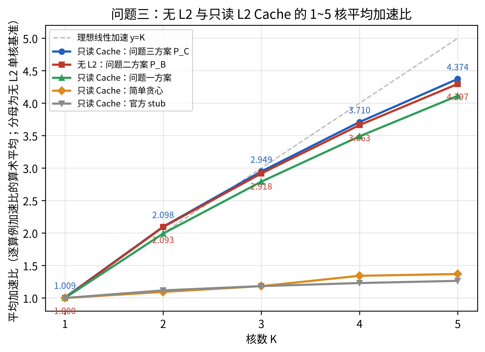
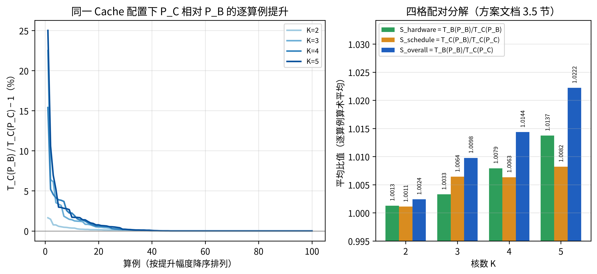
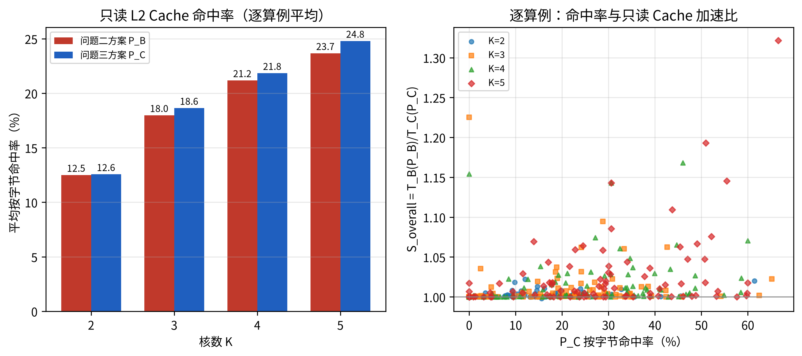

# 2026 研究生数学建模竞赛 A 题 · 问题三（场景 B + 只读 L2 FIFO Cache）求解结果

**结论**：按方案文档“版本二 · 2.3 FIFO 事件状态与有限窗口候选优化”实现的问题三求解器，以问题二最终方案 P_B 为初值，
对 `data/` 下全部 100 个算例、K = 2、3、4、5 共 **400 个方案**全部得到官方问题三评估器的最终结果
（官方合法 400/400；求解期打分与官方命令行复核一致 400/400）。

- **只读 Cache 下平均加速比（分母：无 L2 单核基准，逐算例算术平均）**：2.098 / 2.949 / 3.710 / 4.374（K=2/3/4/5；K=1 为 1.0086）；
  同口径**无 L2（问题二方案 P_B）**为 2.093 / 2.918 / 3.663 / 4.297。
- **方案文档 3.5 节四组配对**（逐算例比值的算术平均，K=2/3/4/5）：
  S_hardware = T_B(P_B)/T_C(P_B) = 1.0013 / 1.0033 / 1.0079 / 1.0137；
  S_schedule = T_C(P_B)/T_C(P_C) = 1.0011 / 1.0064 / 1.0063 / 1.0082；
  S_overall = T_B(P_B)/T_C(P_C) = 1.0024 / 1.0098 / 1.0144 / 1.0222。
- **Cache 命中率（按字节，逐算例平均）**：P_B 12.50% / 17.98% / 21.18% / 23.67%，
  P_C 12.56% / 18.64% / 21.84% / 24.79%。
- 在只读 Cache 配置下，P_C 优于 stub 400/400、优于简单贪心 388/400、
  优于问题一方案 302/400（持平 93）；P_C 相对 P_B：更优 191、持平 209、更差 0。

| 产出 | 位置 |
|---|---|
| 求解代码（一条命令复现） | `solution_p3/`（入口 `run_all_p3.py`，单算例 `solve_p3.py`） |
| 提交格式结果文件（400 个） | `results_p3/k{2,3,4,5}/case_XXX_multicore_res.json` |
| 官方问题三复核 T_C(P_C) 与日志 | `results_p3/official_eval/k{K}/case_XXX.json`、`case_XXX_problem_3_log.txt` |
| 官方问题二下的 T_B(P_C) | `results_p3/pc_under_b/k{K}/case_XXX.json` |
| 基线（官方问题三评估） | `results_p3/baselines/{single_k1,pB,stub,greedy,p1plan}_k{K}/` |
| 结果汇总 | `results_p3/summary.csv`（逐算例×核数，含四格与命中率）、`results_p3/summary_by_k.csv` |
| 图（SVG + 300 dpi PNG） | `speedup_p3`（加速比折线）、`pairing_p3`（配对对照）、`hitrate_p3`（命中率） |
| 表格 | `results_p3/report_tables.md`（由 `make_report_p3.py` 从 summary.csv 计算） |
| 求解日志 / 验证 | `results_p3/solver_logs/`、`results_p3/validation/verify_eval_c.txt` |

`solution_p1/`、`solution_p2/`、`results_p1/`、`results_p2/` 在问题三中只读引用，未被修改。

---

## 1. 问题三与问题二的区别（以官方评估器 `multicore_cut_evaluate_problem_3.py` 为准）

| 方面 | 问题二 | 问题三（评估器实际语义） |
|---|---|---|
| Task 构造、跨核 COPY、500 cycles 同步、Step1-3、Pipe 顺序 | — | 与问题二**完全相同**（同一套 `_build_scene_b_tasks` 与 Step1-3；Step3 仍按 DDR 60 B/cycle 估计 COPY 时长来排定顺序，不会因 Cache 调整核内顺序） |
| 谁查询 Cache | 无 Cache | 只有 **COPY_IN**；COPY_OUT（写回）永远走 DDR |
| 查询时刻 | — | COPY_IN **发射时**按逻辑张量 id 查询 FIFO：命中 → 进入独立的 `CACHE_READ` 带宽池（250 B/cycle，公平共享，不占 DDR）；未命中 → 进入 DDR 池（60 B/cycle） |
| 插入时刻 | — | 未命中的 COPY_IN **完成后**才插入；插入前的并发读取仍全部 miss（不合并在途请求）；已在 Cache 中的张量不重复插入 |
| 替换 | — | FIFO（`OrderedDict`，命中不刷新顺序）；容量 1,048,576 B，逐个淘汰最早插入项直至放得下；单个张量 > 容量则不缓存（= 容量允许） |
| 缓存键 | — | COPY_IN 输出片上张量的 `logical_tid`（无则张量 id）。因此**原始输入的首次读入、跨核传输的目标端读入、Step2 spill 的换回**只要逻辑张量相同就共享同一个缓存项 |
| 指标 | Makespan、新增搬运 | 另有 `cache_stats`：命中次数/字节、未命中次数/字节、按字节命中率 `hit_bytes/(hit_bytes+miss_bytes)`。**新增搬运 `added_copy_bytes` 口径不变，命中字节仍计入**（它不是物理 DDR 字节） |

## 2. 方案文档与官方评估器的差异记录（以评估器为准）

| # | 方案文档 2.3 / 1.5 的表述 | 评估器实际语义 / 本实现处理 |
|---|---|---|
| 1 | “读取发射时查 Cache、miss 完成后才插入 FIFO；hit 不重排；对象大于容量不缓存” | 一致。补充：插入条件是 `size > capacity` 才拒绝（等于容量可插入）；已存在则不插入；在途重复 miss 各自读 DDR（文档 U07 所说“不假定在途合并”与源码一致）。 |
| 2 | 缓存对象是“共享输入” | 键是**逻辑张量**：跨核传输的目标端 COPY_IN 与 spill 换回也会命中，所以命中率不只来自共享输入；单核方案也可能因 spill 换回命中而变快（25/100 个算例的单核 Makespan 在 Cache 下更小，最大 1.432 倍，case_044）。 |
| 3 | 规划器用 CP-SAT 生成窗口候选并排序 | 本实现把“命中”完全交给官方事件仿真，不在任何模型中把 h_q 作为变量；Cache 窗口候选由规则生成（gather / stagger / stagger2 / colocate / cluster，见 3.2），每个候选完整回放；CP-SAT 只出现在复用的问题二通用邻域（分核窗口、顺序窗口、区间窗口）中。 |
| 4 | “Cache hit 的 COPY 仍然是搬运，总 COPY 字节与 DDR 字节不能混为一列” | 一致：官方 `added_copy_bytes` 在问题三中含命中字节；本 README 的“新增搬运”均为官方字段，另列命中/未命中字节。 |
| 5 | 1.5 节 FIFO 状态 Q_e 与内存驻留分开建模 | Step2 的 spill 决策仍按无 Cache 的规则做（换出/换回位置不变），Cache 只改变换回 COPY_IN 的耗时与带宽池；外层无法让 Step2 感知 Cache。 |
| 6 | 3.5 节四组配对 | 按文档实现：T_B(P_B) 取问题二官方复核结果；T_C(P_B) 由官方问题三命令行评估问题二方案；T_B(P_C) 由官方问题二命令行评估问题三方案；T_C(P_C) 为官方问题三复核。 |

## 3. 方法（方案文档 V2_C）

1. **初值**：读取 `results_p2/k{K}/<case>_multicore_res.json`（问题二最终方案 P_B），在问题三评估器中回放得到 T_C(P_B) 与 Cache 事件轨迹。
2. **高价值重复 miss 窗口**（`improve_c.ranked_reuse_windows`）：对每个逻辑张量统计 miss 序列，按价值 = 字节数 × (miss 次数 − 1) 排序取前 12 个；
   每次 miss 标注为 first（首读）、inflight（首读未完成时的并发读取）或 evicted（曾插入后被 FIFO 淘汰再读）。
3. **有限候选族 Ω_t**（全部通过“子图依赖 DAG 上的优先级 Kahn 解码”保证合法，见问题二 README 3.1）：
   - `gather`：把 evicted 读者所在子图的优先级提到首读子图之后（首读完成后集中消费）；
   - `stagger` / `stagger2`：把 inflight 读者所在子图推迟到“首读完成后才开始的第一个子图”之后（stagger2 再多让一个位置）；
   - `colocate`：把跨核的重复读者子图迁到首读核并紧跟首读子图（同核后续消费者直接用片上副本）；
   - `cluster`：对当前前 12 个高价值张量同时做 gather。
   每个候选调用官方 `evaluate_problem_3` 完整回放（不冻结窗口外时间），按 (T_C, 新增搬运) 字典序严格变好才接受；接受后重新计算窗口排序。
4. **剩余预算**：60% 时间用于第 2–3 步，其余交给问题二的通用邻域（细粒度改核、优先级交换、合并、时间反馈、分核/顺序/区间窗口 CP-SAT），评分函数换成问题三评估器。
5. **预算与单调性**：单个 (算例, K) 预算 `min(180, 30 + 计算节点数/150)` 秒；K 核结果若劣于 K−1 核则沿用 K−1 核方案并补空核心（4 个：case_026 K=5, case_044 K=4, case_044 K=5, case_095 K=5）。

## 4. 验证

1. **评估补丁等价**：问题三同样在进程内给官方 `step3_simulation` 打“完成计数器”补丁（问题二 README 第 2 节第 6 条）。`solution_p3/verify_eval_c.py`
   在 6 个算例 × 5 个方案（3 个 stub 随机方案 + 问题二 K=2、5 方案）上逐项比较 Makespan、各项搬运、`cache_stats`、**完整 Cache 事件序列**、最终 FIFO 内容与各核结束时刻：
   30 个方案、0 处不一致（`validation/verify_eval_c.txt`）。
2. **官方复核**：400 个 P_C 全部由官方问题三命令行（子进程、未打补丁）评估成功，并由官方问题二命令行得到 T_B(P_C)；
   求解期打分与官方输出一致 400/400（`summary.csv` 的 `eval_match` 列）。所有基线同样来自官方命令行。
3. **表格数字**：`make_report_p3.py` 从 `summary.csv` 逐行重新计算各核均值，并断言与 `summary_by_k.csv` 一致（误差 < 1.5e-4）后才输出图表。

## 5. 结果

### 5.1 平均加速比（1~5 核，无 L2 与只读 Cache 对比曲线）



### 表 1  按核数的平均加速比（分母：无 L2 单核基准；逐算例算术平均）

| 核数 K | 用例数 | 无 L2（P_B） | 只读 Cache（P_C） | 问题一方案@Cache | 简单贪心@Cache | stub@Cache | 全部官方合法 |
|---|---|---|---|---|---|---|---|
| 1 | 100 | 1.000 | 1.009 | — | — | — | True |
| 2 | 100 | 2.093 | 2.098 | 1.992 | 1.094 | 1.117 | True |
| 3 | 100 | 2.918 | 2.949 | 2.792 | 1.183 | 1.183 | True |
| 4 | 100 | 3.663 | 3.710 | 3.490 | 1.342 | 1.230 | True |
| 5 | 100 | 4.297 | 4.374 | 4.114 | 1.369 | 1.264 | True |

K=1 行：无 L2 为单核基准本身（=1）；只读 Cache 为同一单核方案在问题三评估器下的结果。


### 5.2 四组配对对照（方案文档 3.5 节）



### 表 2  四格配对分解与 Cache 命中率（方案文档 3.5 节）

| 核数 K | S_hardware | S_schedule | S_overall | 命中率 P_B | 命中率 P_C |
|---|---|---|---|---|---|
| 2 | 1.0013 | 1.0011 | 1.0024 | 12.50% | 12.56% |
| 3 | 1.0033 | 1.0064 | 1.0098 | 17.98% | 18.64% |
| 4 | 1.0079 | 1.0063 | 1.0144 | 21.18% | 21.84% |
| 5 | 1.0137 | 1.0082 | 1.0222 | 23.67% | 24.79% |


### 表 3  四格配对的逐核计数与总和

| 核数 K | Cache 使 P_B 变快 / 不变 / 变慢 | P_C 优于 / 等于 / 劣于 P_B（Cache 下） | 无 L2 下 P_C 劣于 / 优于 P_B | 新增搬运 P_C > P_B | ΣT_B(P_B) | ΣT_C(P_B) | ΣT_B(P_C) | ΣT_C(P_C) |
|---|---|---|---|---|---|---|---|---|
| 2 | 50 / 48 / 2 | 46 / 54 / 0 | 4 / 41 | 19 | 149,499,908 | 149,384,054 | 149,325,728 | 149,178,630 |
| 3 | 56 / 43 / 1 | 47 / 53 / 0 | 14 / 32 | 21 | 101,649,611 | 101,504,676 | 101,420,397 | 101,229,524 |
| 4 | 62 / 37 / 1 | 49 / 51 / 0 | 12 / 33 | 18 | 76,335,494 | 76,108,109 | 76,257,340 | 75,940,068 |
| 5 | 64 / 35 / 1 | 49 / 51 / 0 | 17 / 29 | 26 | 62,968,019 | 62,719,877 | 62,925,355 | 62,596,783 |


- **硬件收益（S_hardware）**：同一 P_B，只读 Cache 使 232/400 个 (算例, K) 变快、5 个变慢；最大 1.1767（case_100 K=5），最小 0.9860（case_092 K=4）。
  Cache 偶尔变慢的原因：命中改变了 COPY_IN 完成时刻，进而改变 Pipe 发射与 DDR 争用的相对时序（事件仿真是非单调的）。
- **调度收益（S_schedule）**：同一 Cache 配置下 P_C 优于 P_B 191 个、持平 209 个、劣于 0 个（接受准则保证不劣）；最大提升 1.2502（case_046 K=5）。
  收益集中在少数算例：多数算例的重复 miss 很少或来自无法通过顺序消除的 FIFO 淘汰。
- **总体（S_overall）**：最大 1.3217（case_046 K=5）。
- **缓存专用计划在无 L2 下**：T_B(P_C) 劣于 T_B(P_B) 47 个、优于 135 个——P_C 的部分改动（主要是通用邻域）在无 L2 下同样有效，部分改动依赖 Cache 命中。
- **搬运**：P_C 的新增搬运高于 P_B 的有 84 个（字典序以 Makespan 优先）。

### 5.3 Cache 命中率



- P_C 全部 400 个方案合计命中 576.1 MiB、未命中 2,644.7 MiB（总体按字节命中率 17.89%），FIFO 淘汰 502,616 次；
  命中率为 0 的方案 83 个（多为分量独立、输入不共享的图，如 case_001、case_084）。
- 命中率随核数上升（更多核并发读取同一张量，第一个 miss 完成后其余核命中），与 S_hardware 随 K 增大一致；但命中率与 S_overall 只弱相关（右图），
  因为命中节省的是 COPY_IN 时间，只有当它位于关键路径或 DDR 饱和时才转化为 Makespan 收益——**最终以官方 Makespan 为准，不以命中率为目标**。

### 5.4 与基线对比

### 表 4  与三种基线的逐核胜负（均为只读 Cache 配置下的官方 Makespan）

| 核数 K | 优于 stub | 优于简单贪心 | 优于问题一方案（严格 / 持平） | 优于单核（Cache） |
|---|---|---|---|---|
| 2 | 100/100 | 97/100 | 77 / 23 | 100/100 |
| 3 | 100/100 | 98/100 | 73 / 26 | 100/100 |
| 4 | 100/100 | 96/100 | 78 / 22 | 100/100 |
| 5 | 100/100 | 97/100 | 74 / 22 | 100/100 |


- 基线说明：stub = 官方随机示例（seed 0）；简单贪心 = 问题一 `interval-dfs/1` 方案；问题一方案 = `results_p1/k{K}`；均在只读 Cache 配置下由官方问题三命令行评估。
  只读 Cache 下各基线平均加速比见表 1（stub 1.117 / 1.183 / 1.230 / 1.264，贪心 1.094 / 1.183 / 1.342 / 1.369，问题一方案 1.992 / 2.792 / 3.490 / 4.114）。
- 各核加速比中位数（P_C）：2.009 / 2.989 / 3.929 / 4.737；最小值：1.506 / 1.934 / 2.166 / 2.318。

### 5.5 局部搜索统计与运行时间

- 精确回放 18,912 次（被官方判为不可执行而舍弃的候选 300 个；其余候选都经优先级 Kahn 解码、构造上合法，因此这些都来自复用的问题一区间窗口解码）。
- Cache 窗口：893 轮窗口、8,683 个候选，其中 731 轮在预算内评价完全部候选（其余因时间或提前接受而截断）。
  接受次数——Cache 窗口：colocate 54、stagger 30、gather 26、cluster 23、stagger2 3；通用邻域：move 183、swap 82、interval 67、order 58、assign 19、merge 5、time-feedback 4。
- 单个 (算例, K) 求解平均 58.7 s、最长 189.7 s；官方问题三复核单个方案平均 1.6 s、最长 15.9 s。

### 表 5  运行时间（秒）

| 核数 K | 求解平均 | 求解最长 | 官方问题三复核平均 | 官方复核最长 |
|---|---|---|---|---|
| 2 | 56.6 | 189.7 | 1.8 | 15.9 |
| 3 | 58.8 | 186.9 | 1.6 | 13.7 |
| 4 | 60.0 | 187.3 | 1.5 | 12.7 |
| 5 | 59.5 | 186.6 | 1.5 | 12.0 |


### 5.6 逐算例结果

### 表 6  逐算例结果（官方问题三评估器；Makespan 单位 cycles）

| 用例 | 单核 无 L2 / Cache | K=2 T_C(P_C) / 命中率 | K=3 | K=4 | K=5 | K=2..5 S_overall | K=4 四格 T_B(P_B) / T_C(P_B) / T_B(P_C) / T_C(P_C) |
|---|---|---|---|---|---|---|---|
| case_001 | 233,110 / 233,110 | 116,868 / 0.000 | 78,545 / 0.000 | 58,984 / 0.000 | 47,502 / 0.000 | 1.000/1.000/1.000/1.000 | 58,984 / 58,984 / 58,984 / 58,984 |
| case_002 | 261,945 / 261,945 | 125,710 / 0.306 | 89,986 / 0.180 | 69,692 / 0.000 | 55,812 / 0.000 | 1.003/1.004/1.000/1.000 | 69,692 / 69,692 / 69,692 / 69,692 |
| case_003 | 602,212 / 602,212 | 308,247 / 0.078 | 234,008 / 0.386 | 195,766 / 0.486 | 174,202 / 0.507 | 1.002/1.013/1.027/1.047 | 201,011 / 196,840 / 199,940 / 195,766 |
| case_004 | 392,357 / 392,357 | 198,622 / 0.000 | 130,926 / 0.000 | 104,188 / 0.000 | 85,093 / 0.196 | 1.000/1.000/1.000/1.000 | 104,188 / 104,188 / 104,188 / 104,188 |
| case_005 | 95,618 / 95,618 | 54,071 / 0.088 | 44,708 / 0.309 | 36,692 / 0.447 | 33,907 / 0.522 | 1.002/1.022/1.065/1.076 | 39,085 / 36,693 / 39,085 / 36,692 |
| case_006 | 82,837 / 82,837 | 38,822 / 0.029 | 31,151 / 0.000 | 24,769 / 0.236 | 22,040 / 0.301 | 1.000/1.000/1.000/1.039 | 24,772 / 24,769 / 24,772 / 24,769 |
| case_007 | 1,012,562 / 1,012,562 | 507,494 / 0.000 | 338,094 / 0.000 | 254,398 / 0.000 | 203,834 / 0.000 | 1.000/1.000/1.000/1.000 | 254,398 / 254,398 / 254,398 / 254,398 |
| case_008 | 487,605 / 487,605 | 136,244 / 0.000 | 110,229 / 0.000 | 104,264 / 0.000 | 100,603 / 0.000 | 1.000/1.000/1.000/1.000 | 104,264 / 104,264 / 104,264 / 104,264 |
| case_009 | 153,261 / 153,261 | 86,593 / 0.226 | 62,859 / 0.291 | 55,047 / 0.364 | 46,555 / 0.390 | 1.003/1.006/1.002/1.005 | 55,128 / 55,110 / 55,070 / 55,047 |
| case_010 | 86,969 / 86,969 | 40,554 / 0.244 | 26,740 / 0.288 | 23,999 / 0.342 | 23,630 / 0.340 | 1.003/1.095/1.028/1.044 | 24,670 / 24,331 / 24,879 / 23,999 |
| case_011 | 184,697 / 184,697 | 92,646 / 0.000 | 63,957 / 0.542 | 46,880 / 0.000 | 46,880 / 0.000 | 1.000/1.001/1.000/1.000 | 46,880 / 46,880 / 46,880 / 46,880 |
| case_012 | 59,088 / 59,088 | 26,349 / 0.145 | 19,596 / 0.019 | 14,530 / 0.056 | 12,146 / 0.065 | 1.008/1.000/1.000/1.017 | 14,530 / 14,530 / 14,530 / 14,530 |
| case_013 | 263,949 / 263,949 | 132,198 / 0.000 | 88,351 / 0.000 | 67,017 / 0.000 | 54,468 / 0.000 | 1.000/1.000/1.000/1.000 | 67,017 / 67,017 / 67,017 / 67,017 |
| case_014 | 17,698,626 / 17,689,602 | 8,805,518 / 0.138 | 5,932,257 / 0.200 | 4,434,173 / 0.108 | 3,529,114 / 0.142 | 1.001/1.001/1.000/1.002 | 4,435,855 / 4,434,723 / 4,437,840 / 4,434,173 |
| case_015 | 177,362 / 177,362 | 86,830 / 0.131 | 60,250 / 0.226 | 48,512 / 0.206 | 37,420 / 0.289 | 1.000/1.000/1.002/1.000 | 48,585 / 48,512 / 48,585 / 48,512 |
| case_016 | 7,715,523 / 7,715,523 | 4,794,163 / 0.037 | 3,680,632 / 0.016 | 2,247,344 / 0.548 | 2,238,798 / 0.597 | 1.001/1.001/1.002/1.002 | 2,252,262 / 2,247,954 / 2,251,238 / 2,247,344 |
| case_017 | 162,810 / 162,810 | 75,942 / 0.134 | 46,638 / 0.025 | 37,456 / 0.096 | 29,834 / 0.139 | 1.000/1.035/1.000/1.069 | 37,456 / 37,456 / 37,456 / 37,456 |
| case_018 | 1,004,367 / 1,003,110 | 499,957 / 0.456 | 338,555 / 0.458 | 250,137 / 0.487 | 203,149 / 0.577 | 1.001/1.000/1.011/1.000 | 252,907 / 252,716 / 251,305 / 250,137 |
| case_019 | 81,144 / 81,144 | 27,585 / 0.112 | 21,216 / 0.189 | 16,540 / 0.212 | 13,784 / 0.170 | 1.008/1.037/1.029/1.043 | 17,026 / 16,549 / 17,014 / 16,540 |
| case_020 | 532,746 / 532,746 | 266,580 / 0.000 | 177,950 / 0.000 | 133,704 / 0.000 | 107,726 / 0.000 | 1.000/1.000/1.000/1.000 | 133,704 / 133,704 / 133,704 / 133,704 |
| case_021 | 6,567,937 / 6,558,837 | 3,147,031 / 0.334 | 2,148,392 / 0.047 | 1,550,324 / 0.000 | 1,247,884 / 0.533 | 1.000/1.001/1.000/1.001 | 1,550,324 / 1,550,324 / 1,550,324 / 1,550,324 |
| case_022 | 56,780 / 56,780 | 28,463 / 0.132 | 19,072 / 0.000 | 14,631 / 0.031 | 11,810 / 0.031 | 1.000/1.000/1.000/1.000 | 14,631 / 14,631 / 14,631 / 14,631 |
| case_023 | 122,614 / 122,614 | 49,532 / 0.120 | 31,825 / 0.197 | 30,252 / 0.352 | 25,493 / 0.247 | 1.022/1.005/1.037/1.000 | 31,367 / 31,365 / 31,174 / 30,252 |
| case_024 | 2,555,343 / 2,555,343 | 1,570,935 / 0.098 | 1,207,850 / 0.051 | 748,949 / 0.585 | 745,110 / 0.599 | 1.002/1.004/1.006/1.004 | 753,270 / 748,962 / 753,291 / 748,949 |
| case_025 | 4,863,026 / 4,863,026 | 2,431,840 / 0.000 | 1,622,164 / 0.000 | 1,217,470 / 0.000 | 975,360 / 0.000 | 1.000/1.000/1.000/1.000 | 1,217,470 / 1,217,470 / 1,217,470 / 1,217,470 |
| case_026 | 99,203 / 99,203 | 51,664 / 0.214 | 37,319 / 0.333 | 34,103 / 0.306 | 34,103 / 0.306 | 1.001/1.060/1.143/1.143 | 38,976 / 35,877 / 38,165 / 34,103 |
| case_027 | 2,363,952 / 2,359,515 | 1,115,722 / 0.000 | 744,658 / 0.280 | 559,196 / 0.000 | 449,121 / 0.339 | 1.000/1.000/1.000/1.001 | 559,196 / 559,196 / 559,196 / 559,196 |
| case_028 | 43,836,040 / 43,836,040 | 20,100,883 / 0.035 | 13,409,448 / 0.115 | 10,143,667 / 0.094 | 8,240,310 / 0.115 | 1.005/1.006/1.003/1.005 | 10,176,437 / 10,143,667 / 10,176,437 / 10,143,667 |
| case_029 | 37,555 / 37,555 | 19,740 / 0.000 | 12,743 / 0.000 | 9,886 / 0.060 | 8,321 / 0.045 | 1.000/1.000/1.000/1.005 | 9,886 / 9,886 / 9,886 / 9,886 |
| case_030 | 2,808,034 / 2,807,891 | 1,402,710 / 0.356 | 941,995 / 0.424 | 706,838 / 0.267 | 564,152 / 0.294 | 1.000/1.000/1.000/1.000 | 707,133 / 706,838 / 707,133 / 706,838 |
| case_031 | 1,414,369 / 1,414,159 | 698,768 / 0.298 | 472,498 / 0.346 | 355,012 / 0.391 | 282,153 / 0.436 | 1.003/1.003/1.002/1.000 | 355,562 / 355,012 / 355,538 / 355,012 |
| case_032 | 41,443 / 41,443 | 18,904 / 0.021 | 12,830 / 0.042 | 10,733 / 0.049 | 10,733 / 0.049 | 1.000/1.000/1.000/1.000 | 10,733 / 10,733 / 10,733 / 10,733 |
| case_033 | 1,774,196 / 1,774,080 | 883,777 / 0.218 | 602,296 / 0.279 | 441,214 / 0.376 | 358,218 / 0.389 | 1.001/1.000/1.001/1.000 | 441,529 / 441,214 / 441,529 / 441,214 |
| case_034 | 842,996 / 842,733 | 416,143 / 0.189 | 276,722 / 0.315 | 210,793 / 0.451 | 162,384 / 0.479 | 1.002/1.000/1.000/1.001 | 210,907 / 210,803 / 210,857 / 210,793 |
| case_035 | 169,571 / 169,571 | 95,406 / 0.000 | 87,679 / 0.298 | 74,175 / 0.336 | 59,769 / 0.197 | 1.000/1.004/1.011/1.008 | 75,009 / 74,603 / 74,508 / 74,175 |
| case_036 | 931,510 / 931,510 | 466,068 / 0.000 | 311,345 / 0.000 | 233,584 / 0.000 | 187,182 / 0.000 | 1.000/1.000/1.000/1.000 | 233,584 / 233,584 / 233,584 / 233,584 |
| case_037 | 210,001 / 210,001 | 105,374 / 0.000 | 74,038 / 0.348 | 53,320 / 0.000 | 43,013 / 0.182 | 1.000/1.000/1.000/1.000 | 53,320 / 53,320 / 53,320 / 53,320 |
| case_038 | 1,364,555 / 1,363,312 | 669,890 / 0.304 | 455,607 / 0.204 | 336,289 / 0.473 | 271,491 / 0.293 | 1.001/1.001/1.003/1.017 | 337,197 / 336,840 / 342,039 / 336,289 |
| case_039 | 1,435,262 / 1,435,262 | 710,155 / 0.328 | 478,152 / 0.219 | 363,921 / 0.325 | 327,297 / 0.000 | 1.010/1.000/1.060/1.000 | 385,929 / 370,849 / 377,797 / 363,921 |
| case_040 | 253,454 / 253,454 | 122,362 / 0.000 | 110,105 / 0.000 | 110,105 / 0.000 | 103,588 / 0.216 | 1.000/1.000/1.000/1.038 | 110,105 / 110,105 / 110,105 / 110,105 |
| case_041 | 6,003,957 / 6,001,575 | 2,985,015 / 0.238 | 2,002,428 / 0.279 | 1,498,849 / 0.253 | 1,191,814 / 0.267 | 1.001/1.002/1.002/1.004 | 1,502,089 / 1,498,942 / 1,501,602 / 1,498,849 |
| case_042 | 1,686,740 / 1,675,633 | 823,352 / 0.342 | 560,553 / 0.423 | 418,743 / 0.429 | 338,945 / 0.488 | 1.006/1.008/1.000/1.002 | 418,795 / 418,743 / 418,795 / 418,743 |
| case_043 | 677,656 / 677,656 | 333,725 / 0.226 | 271,072 / 0.060 | 228,946 / 0.400 | 190,982 / 0.470 | 1.000/1.000/1.029/1.047 | 235,671 / 230,315 / 234,607 / 228,946 |
| case_044 | 154,407 / 107,814 | 43,294 / 0.177 | 43,294 / 0.177 | 43,294 / 0.177 | 43,294 / 0.177 | 1.018/1.018/1.016/1.016 | 43,967 / 43,890 / 49,737 / 43,294 |
| case_045 | 125,614 / 125,614 | 63,059 / 0.000 | 42,304 / 0.000 | 32,037 / 0.000 | 25,860 / 0.000 | 1.000/1.000/1.000/1.000 | 32,037 / 32,037 / 32,037 / 32,037 |
| case_046 | 276,455 / 244,994 | 107,250 / 0.000 | 80,252 / 0.625 | 75,880 / 0.153 | 59,409 / 0.665 | 1.001/1.002/1.038/1.322 | 78,779 / 78,779 / 80,288 / 75,880 |
| case_047 | 326,508 / 326,508 | 192,860 / 0.058 | 125,303 / 0.351 | 112,411 / 0.413 | 98,269 / 0.456 | 1.000/1.000/1.009/1.017 | 113,414 / 112,496 / 113,363 / 112,411 |
| case_048 | 222,220 / 222,220 | 135,066 / 0.119 | 111,394 / 0.116 | 102,597 / 0.192 | 95,866 / 0.233 | 1.004/1.000/1.001/1.006 | 102,681 / 102,597 / 102,681 / 102,597 |
| case_049 | 196,276 / 196,276 | 111,141 / 0.018 | 78,742 / 0.209 | 64,597 / 0.340 | 59,361 / 0.377 | 1.000/1.007/1.012/1.026 | 65,351 / 64,946 / 64,967 / 64,597 |
| case_050 | 149,690 / 149,690 | 80,644 / 0.223 | 59,258 / 0.295 | 52,071 / 0.374 | 44,101 / 0.422 | 1.000/1.002/1.005/1.015 | 52,315 / 52,142 / 52,270 / 52,071 |
| case_051 | 607,628 / 607,628 | 353,515 / 0.240 | 275,159 / 0.324 | 183,177 / 0.586 | 181,512 / 0.600 | 1.010/1.011/1.024/1.018 | 187,486 / 183,178 / 187,485 / 183,177 |
| case_052 | 180,301 / 180,301 | 77,796 / 0.098 | 56,051 / 0.147 | 44,292 / 0.192 | 37,894 / 0.237 | 1.018/1.019/1.027/1.000 | 45,504 / 44,560 / 45,379 / 44,292 |
| case_053 | 1,472,686 / 1,428,109 | 704,144 / 0.104 | 521,530 / 0.190 | 422,555 / 0.600 | 339,712 / 0.555 | 1.004/1.023/1.070/1.145 | 452,294 / 438,991 / 461,799 / 422,555 |
| case_054 | 815,051 / 815,051 | 436,782 / 0.083 | 328,217 / 0.179 | 265,258 / 0.244 | 219,559 / 0.282 | 1.003/1.002/1.004/1.022 | 266,398 / 265,260 / 266,398 / 265,258 |
| case_055 | 118,835 / 118,835 | 56,378 / 0.241 | 33,935 / 0.156 | 30,337 / 0.067 | 21,601 / 0.217 | 1.003/1.000/1.000/1.000 | 30,337 / 30,337 / 30,337 / 30,337 |
| case_056 | 277,285 / 277,285 | 151,954 / 0.142 | 117,352 / 0.346 | 104,696 / 0.352 | 82,733 / 0.407 | 1.000/1.004/1.013/1.001 | 106,100 / 105,572 / 105,132 / 104,696 |
| case_057 | 59,726 / 59,726 | 29,738 / 0.012 | 21,014 / 0.041 | 16,122 / 0.081 | 14,347 / 0.000 | 1.000/1.000/1.000/1.000 | 16,122 / 16,122 / 16,122 / 16,122 |
| case_058 | 4,539,717 / 4,539,717 | 2,215,800 / 0.186 | 1,526,307 / 0.000 | 1,128,564 / 0.208 | 948,039 / 0.009 | 1.004/1.000/1.018/1.000 | 1,148,398 / 1,135,453 / 1,150,407 / 1,128,564 |
| case_059 | 829,473 / 815,938 | 369,318 / 0.000 | 246,737 / 0.234 | 185,216 / 0.000 | 150,736 / 0.353 | 1.000/1.000/1.000/1.000 | 185,216 / 185,216 / 185,216 / 185,216 |
| case_060 | 888,789 / 887,801 | 420,984 / 0.246 | 291,593 / 0.393 | 213,832 / 0.383 | 172,541 / 0.461 | 1.006/1.001/1.009/1.001 | 215,692 / 215,400 / 214,948 / 213,832 |
| case_061 | 77,191 / 77,191 | 42,926 / 0.034 | 29,137 / 0.029 | 23,376 / 0.075 | 20,507 / 0.179 | 1.000/1.000/1.000/1.018 | 23,376 / 23,376 / 23,376 / 23,376 |
| case_062 | 2,854,809 / 2,854,809 | 1,429,109 / 0.000 | 954,913 / 0.000 | 736,761 / 0.000 | 604,983 / 0.001 | 1.000/1.000/1.000/1.000 | 736,761 / 736,761 / 736,761 / 736,761 |
| case_063 | 1,070,397 / 1,070,397 | 536,982 / 0.000 | 361,898 / 0.000 | 278,870 / 0.000 | 226,140 / 0.000 | 1.001/1.000/1.000/1.000 | 278,870 / 278,870 / 278,870 / 278,870 |
| case_064 | 19,116 / 19,116 | 12,692 / 0.165 | 9,405 / 0.335 | 8,053 / 0.410 | 8,053 / 0.410 | 1.000/1.000/1.010/1.010 | 8,135 / 8,063 / 8,135 / 8,053 |
| case_065 | 53,068 / 53,068 | 24,941 / 0.061 | 17,654 / 0.242 | 13,476 / 0.158 | 10,619 / 0.013 | 1.000/1.032/1.000/1.000 | 13,476 / 13,476 / 13,476 / 13,476 |
| case_066 | 359,070 / 359,070 | 190,363 / 0.197 | 145,326 / 0.267 | 128,818 / 0.379 | 101,433 / 0.389 | 1.001/1.009/1.011/1.036 | 130,286 / 128,818 / 130,286 / 128,818 |
| case_067 | 63,834,834 / 63,834,834 | 29,799,770 / 0.078 | 19,818,988 / 0.206 | 14,857,451 / 0.254 | 11,973,702 / 0.174 | 1.001/1.001/1.004/1.000 | 14,915,435 / 14,860,471 / 14,910,517 / 14,857,451 |
| case_068 | 362,095 / 362,095 | 194,144 / 0.192 | 157,149 / 0.220 | 124,333 / 0.292 | 111,246 / 0.245 | 1.001/1.012/1.026/1.064 | 127,589 / 124,689 / 127,293 / 124,333 |
| case_069 | 25,144 / 25,144 | 14,269 / 0.118 | 11,415 / 0.191 | 10,306 / 0.346 | 9,742 / 0.437 | 1.001/1.011/1.048/1.109 | 10,806 / 10,775 / 11,053 / 10,306 |
| case_070 | 117,300 / 117,300 | 57,992 / 0.147 | 39,158 / 0.151 | 29,048 / 0.176 | 25,221 / 0.167 | 1.000/1.000/1.000/1.003 | 29,048 / 29,048 / 29,048 / 29,048 |
| case_071 | 18,919 / 18,919 | 11,181 / 0.092 | 9,203 / 0.241 | 8,622 / 0.271 | 7,294 / 0.454 | 1.008/1.062/1.074/1.063 | 9,262 / 8,978 / 9,041 / 8,622 |
| case_072 | 23,897,828 / 23,890,756 | 11,839,532 / 0.082 | 7,924,573 / 0.104 | 5,916,394 / 0.113 | 4,780,685 / 0.094 | 1.001/1.001/1.001/1.007 | 5,921,768 / 5,916,394 / 5,921,768 / 5,916,394 |
| case_073 | 10,081,626 / 10,081,626 | 4,150,254 / 0.156 | 2,765,882 / 0.652 | 2,139,350 / 0.253 | 1,765,506 / 0.336 | 0.998/1.023/1.014/1.001 | 2,168,614 / 2,139,350 / 2,168,614 / 2,139,350 |
| case_074 | 1,682,239 / 1,678,120 | 804,801 / 0.199 | 543,011 / 0.285 | 411,829 / 0.297 | 330,137 / 0.227 | 1.008/1.012/1.004/1.008 | 413,409 / 412,797 / 414,831 / 411,829 |
| case_075 | 1,441,809 / 1,441,809 | 741,076 / 0.083 | 574,770 / 0.241 | 435,900 / 0.308 | 380,456 / 0.294 | 1.001/1.017/1.002/1.020 | 436,934 / 435,917 / 436,934 / 435,900 |
| case_076 | 6,185,113 / 6,183,098 | 3,086,197 / 0.151 | 2,056,815 / 0.155 | 1,551,218 / 0.218 | 1,245,249 / 0.279 | 1.001/1.000/1.001/1.013 | 1,553,246 / 1,551,218 / 1,553,246 / 1,551,218 |
| case_077 | 495,320 / 495,320 | 239,218 / 0.026 | 165,380 / 0.026 | 123,194 / 0.049 | 115,927 / 0.046 | 1.000/1.002/1.004/1.000 | 123,709 / 123,194 / 123,709 / 123,194 |
| case_078 | 2,296,143 / 2,296,143 | 1,028,018 / 0.412 | 691,202 / 0.255 | 519,179 / 0.355 | 463,091 / 0.300 | 1.000/1.000/1.002/1.030 | 520,213 / 519,213 / 519,945 / 519,179 |
| case_079 | 31,052,251 / 31,052,251 | 15,082,088 / 0.191 | 9,965,989 / 0.229 | 7,433,605 / 0.210 | 6,039,741 / 0.252 | 1.005/1.003/1.002/1.001 | 7,450,249 / 7,448,251 / 7,435,087 / 7,433,605 |
| case_080 | 292,138 / 291,826 | 145,371 / 0.141 | 101,509 / 0.009 | 93,405 / 0.185 | 82,233 / 0.173 | 1.004/1.000/1.019/1.018 | 95,154 / 93,405 / 95,154 / 93,405 |
| case_081 | 151,795 / 151,795 | 76,860 / 0.000 | 51,943 / 0.000 | 38,736 / 0.085 | 30,943 / 0.000 | 1.000/1.000/1.022/1.000 | 39,605 / 39,605 / 38,736 / 38,736 |
| case_082 | 721,041 / 721,041 | 382,250 / 0.051 | 276,784 / 0.324 | 227,745 / 0.467 | 199,532 / 0.535 | 1.001/1.001/1.003/1.007 | 228,475 / 227,745 / 228,475 / 227,745 |
| case_083 | 1,057,993 / 946,145 | 417,497 / 0.031 | 307,778 / 0.228 | 253,134 / 0.127 | 251,415 / 0.116 | 1.000/1.004/1.022/1.029 | 258,782 / 258,782 / 253,134 / 253,134 |
| case_084 | 2,507,412 / 2,507,412 | 686,504 / 0.000 | 459,944 / 0.000 | 383,977 / 0.000 | 381,521 / 0.000 | 1.000/1.225/1.000/1.007 | 384,094 / 384,094 / 383,977 / 383,977 |
| case_085 | 3,187,899 / 3,187,899 | 1,623,338 / 0.047 | 1,216,102 / 0.129 | 981,848 / 0.474 | 826,216 / 0.508 | 1.000/1.007/1.005/1.018 | 986,615 / 981,848 / 986,615 / 981,848 |
| case_086 | 118,403 / 118,403 | 64,839 / 0.224 | 52,464 / 0.371 | 46,431 / 0.433 | 39,819 / 0.491 | 1.004/1.013/1.035/1.067 | 48,045 / 46,432 / 48,044 / 46,431 |
| case_087 | 3,974,071 / 3,969,779 | 1,980,452 / 0.183 | 1,319,807 / 0.211 | 1,002,417 / 0.210 | 803,557 / 0.248 | 1.003/1.001/1.002/1.005 | 1,004,535 / 1,002,417 / 1,004,535 / 1,002,417 |
| case_088 | 243,623 / 243,623 | 134,246 / 0.147 | 104,873 / 0.260 | 85,897 / 0.262 | 77,611 / 0.288 | 1.013/1.009/1.031/1.058 | 88,592 / 87,194 / 87,261 / 85,897 |
| case_089 | 693,092 / 693,092 | 303,577 / 0.092 | 218,760 / 0.147 | 165,384 / 0.168 | 135,556 / 0.000 | 1.000/1.000/1.001/1.000 | 165,520 / 165,384 / 165,520 / 165,384 |
| case_090 | 1,178,363 / 1,178,363 | 424,692 / 0.076 | 312,247 / 0.154 | 279,609 / 0.159 | 278,394 / 0.160 | 1.000/1.004/1.009/1.014 | 282,184 / 280,217 / 281,979 / 279,609 |
| case_091 | 9,186,769 / 9,168,820 | 4,576,301 / 0.215 | 3,064,508 / 0.234 | 2,302,433 / 0.210 | 1,857,020 / 0.290 | 1.000/1.002/1.002/1.011 | 2,305,902 / 2,302,433 / 2,305,902 / 2,302,433 |
| case_092 | 4,815,554 / 4,333,631 | 2,046,992 / 0.614 | 1,417,624 / 0.047 | 1,102,259 / 0.118 | 964,933 / 0.095 | 1.020/1.012/1.011/1.000 | 1,114,693 / 1,130,467 / 1,118,627 / 1,102,259 |
| case_093 | 74,205 / 74,205 | 37,827 / 0.000 | 25,103 / 0.000 | 19,743 / 0.010 | 15,876 / 0.000 | 1.000/1.000/1.002/1.000 | 19,779 / 19,779 / 19,779 / 19,743 |
| case_094 | 94,892 / 94,892 | 42,775 / 0.162 | 30,503 / 0.186 | 24,935 / 0.304 | 18,369 / 0.228 | 1.011/1.031/1.000/1.059 | 24,935 / 24,935 / 24,935 / 24,935 |
| case_095 | 2,084,853 / 2,084,853 | 573,788 / 0.000 | 474,232 / 0.000 | 410,945 / 0.000 | 410,945 / 0.000 | 1.000/1.000/1.154/1.017 | 474,232 / 474,232 / 410,945 / 410,945 |
| case_096 | 84,194 / 84,194 | 31,700 / 0.133 | 24,201 / 0.270 | 21,977 / 0.304 | 21,977 / 0.304 | 1.001/1.018/1.028/1.028 | 22,604 / 22,017 / 22,563 / 21,977 |
| case_097 | 11,491,509 / 11,491,509 | 5,152,906 / 0.000 | 3,437,689 / 0.195 | 2,577,788 / 0.000 | 2,064,506 / 0.272 | 1.000/1.000/1.000/1.000 | 2,577,788 / 2,577,788 / 2,577,788 / 2,577,788 |
| case_098 | 177,430 / 177,430 | 89,620 / 0.000 | 72,316 / 0.134 | 70,969 / 0.235 | 55,960 / 0.306 | 1.000/1.000/1.000/1.085 | 70,969 / 70,969 / 70,969 / 70,969 |
| case_099 | 1,622,999 / 1,618,902 | 807,949 / 0.278 | 542,514 / 0.316 | 405,760 / 0.340 | 331,201 / 0.312 | 1.001/1.003/1.006/1.011 | 408,104 / 405,760 / 408,104 / 405,760 |
| case_100 | 151,223 / 151,223 | 75,418 / 0.260 | 50,874 / 0.426 | 42,865 / 0.460 | 38,903 / 0.510 | 1.000/1.062/1.168/1.193 | 50,076 / 43,382 / 50,180 / 42,865 |

## 6. 发现的问题与局限

1. **只读 Cache 的收益整体有限**：对问题二已优化的方案，S_hardware 平均仅 1.0013 / 1.0033 / 1.0079 / 1.0137。主要原因：(a) 原始输入在场景 B 中每核只读一次，跨核共享输入的重复读取本来就少；
   (b) 大算例的重复读取多来自 spill 换回，其间隔远超 1 MiB FIFO 的覆盖范围，被淘汰后再读（例如 case_014 K=4 的 P_B 有 8,587 次“淘汰后重读”）；(c) 命中节省的 COPY_IN 时间只有在关键路径上才转化为 Makespan。
2. **核内顺序对 Cache 不敏感**：Step1-3 仍按无 Cache 的 DDR 带宽排定 Pipe 顺序，外层只能通过子图归属与名次间接影响“谁先读、何时读”，这限制了窗口候选的效果。
3. **事件仿真非单调**：命中会改变后续事件次序，个别算例在 Cache 下反而变慢（5 个 (算例, K)），因此一切改动都必须完整回放，不能用命中率或局部代理直接判优。
4. **各类 Cache 窗口候选的有效性**：接受次数依次为 colocate 54、stagger 30、gather 26、cluster 23、stagger2 3（跨越全部 400 个方案）。colocate 把重复读者并到首读核，
   同核后续消费者直接复用片上副本、完全省去 COPY_IN，因此收益最直接，但目标核负载允许时才被接受；stagger 常常使解码顺序不变或拖慢首读核，
   接受率较低。
5. **非位级复现**：预算按墙钟截断，CP-SAT 有时间上限，重跑结果可能有 1% 量级差异；提交结果以本目录文件为准，均经官方复核。
6. **断点续跑**：批处理曾被误报中断，实际一直在运行；`run_all_p3.py` 已加入“方案与日志均为完整 JSON 才跳过”的续跑判据，写到一半的文件会被重算。

## 7. 运行方式

```bash
# 依赖：Python ≥ 3.10；OR-Tools（CP-SAT，缺失时跳过相关邻域）；matplotlib（仅画图）
python3 -m venv .venv && .venv/bin/pip install ortools matplotlib
# 需要先有问题二结果（初值 P_B 与 T_B(P_B)）以及问题一的单核基准、贪心与最终方案（基线）
.venv/bin/python solution_p3/run_all_p3.py --workers 6      # 求解→单调性→官方复核（问题三、问题二）→基线→summary
.venv/bin/python solution_p3/make_report_p3.py             # 图（SVG+PNG）与 report_tables.md
.venv/bin/python solution_p3/write_readme_p3.py            # 本 README
# 单个算例
.venv/bin/python solution_p3/solve_p3.py 数据包/data/case_046.json -k 5 --budget 120 -o case_046_multicore_res.json
python3 数据包/code/multicore_cut_evaluate_problem_3.py 数据包/data/case_046.json case_046_multicore_res.json --config 数据包/data/config.txt
# 验证
python3 solution_p3/verify_eval_c.py case_064 case_001 case_005 case_003 case_044 case_016
```
8 核机器上第一条命令约 2 小时（400 次求解平均 59 s，6 进程并行，外加官方复核与基线）。

## 8. 代码结构（`solution_p3/`）

| 文件 | 作用 |
|---|---|
| `common_c.py` | 路径；复用问题一/二模块；用官方函数读取 `[problem_3]` Cache 参数 |
| `eval_c.py` | 官方 `evaluate_problem_3` 包装（复用问题二的 step3 计数器补丁） |
| `improve_c.py` | Cache 事件分析、重复 miss 窗口排序、gather/stagger/colocate/cluster 候选、复用问题二通用邻域（以 T_C 评分） |
| `solve_p3.py` | 单个 (算例, K) 主流程：读 P_B → 回放 → 窗口候选 → 通用邻域 → 输出 |
| `run_all_p3.py` | 全量求解（断点续跑）、单调性、官方问题三/问题二复核、基线、汇总 |
| `run_baselines_p3.py` | 单核@Cache、P_B@Cache、stub、贪心、问题一方案的官方问题三评估 |
| `make_report_p3.py` | 三张图（SVG + 300 dpi PNG）与 report_tables.md，含与 summary_by_k.csv 的交叉核对 |
| `write_readme_p3.py` | 生成本 README（数字全部现场计算） |
| `verify_eval_c.py` | 评估补丁等价性验证 |
