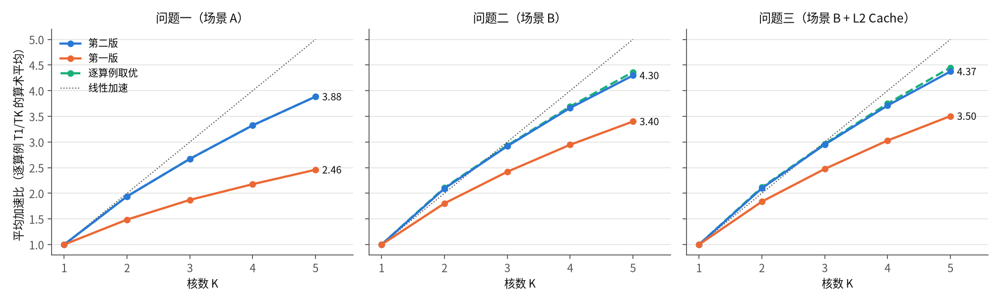
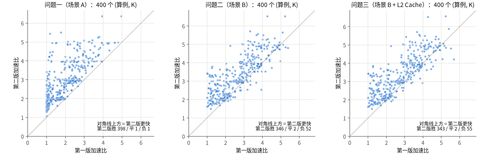
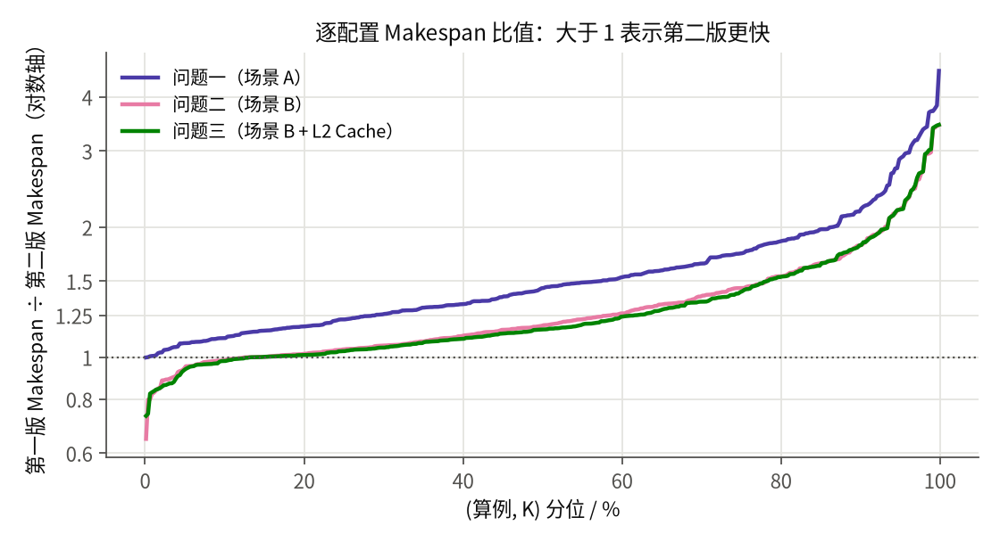

# 第一版 vs 第二版：问题一、二、三答案对比（官方评估器逐例复评）

**结论（一句话）**：三问都是**第二版明显更好**。以题目口径（逐算例加速比的算术平均）计，K=2/3/4/5 时：

| | 第一版 | 第二版 | 第二版领先 | 逐配置胜 / 平 / 负（第二版视角） |
|---|---|---|---|---|
| 问题一 | 1.486 / 1.870 / 2.177 / 2.458 | **1.939 / 2.670 / 3.324 / 3.884** | +30.5% / +42.8% / +52.7% / +58.0% | 398 / 1 / 1 |
| 问题二 | 1.803 / 2.419 / 2.945 / 3.399 | **2.093 / 2.918 / 3.663 / 4.297** | +16.1% / +20.6% / +24.4% / +26.4% | 346 / 2 / 52 |
| 问题三 | 1.837 / 2.474 / 3.028 / 3.504 | **2.098 / 2.949 / 3.710 / 4.374** | +14.2% / +19.2% / +22.5% / +24.8% | 343 / 2 / 55 |

- 问题一：第二版几乎全胜，第一版唯一的胜例只快 0.17%。**论文直接用第二版。**
- 问题二、三：第一版在约 13% 的配置上更快（52/400、55/400）。这些配置集中在小图上，单例最多快 35%。
- 逐算例取优是合法的：每份方案都单独通过官方评估器，本目录已给出经官方验证的合并集 `merged/`。合并后 K=5 的平均加速比，问题二从 4.297 升到 4.363，问题三从 4.374 升到 4.452；问题一只升 0.0005。
- 第一版补充实验（952 组配置、57 个更优候选）**不改变任何结论**。57 个候选中只有 6 个比第二版快，集中在 case_023、case_073、case_093 三张图上；其中只有 2 个把第一版原来的负局变成胜局。

**数字来源**：本文所有数字都来自本次用同一份官方评估器、对两版全部 1,200 个 (问题, 算例, K) 方案逐个重新评估的结果，不是抄自两版报告。加速比分母统一用官方 `singlecore_evaluate.py` 的单核结果。复评值与两版各自报告的数值**逐项一致**（Makespan 与新增搬运量，0 处不符）。



---

## 0. 口径、材料与一致性检查

### 0.1 两版用的是同一份数据和评估器（哈希核验）
由 `check_integrity.py` 核验，结果见 `integrity/integrity_report.json`：

| 检查项 | 结果 |
|---|---|
| `数据包/` 与 `A题数据包.zip` 的 113 个文件（code/data/docs）逐文件 SHA-256 | 完全一致 |
| 第一版三份 `official/` 副本（v1_problem1/2/3）与 `数据包/` | 三份均完全一致 |
| 第一版运行时写入 metadata 的官方代码与 config 哈希（P1/P2/P3 全部 metadata） | 与当前 `数据包/code`、`config.txt` 一致，0 处不符 |
| 100 个 case_*.json 按文件名拼接的 SHA-256 | `ca7b3ab7…776c`，与第二版问题二对照分析（`用户对照_问题二/对比分析.md` 2.1 节）记录的值相同 |
| 第一版发布包 `v1.zip` 的 SHA-256 | `f85e1209…2acf`，与仓库 README 公布值一致 |
| 第一版解压目录与 MANIFEST.json（3,269 个文件） | 字节数与哈希全部一致，无多余文件；本次对比未改动 |
| 第二版 `solution_p1/p2`、`results_p1/p2`（5,776 个文件） | 与对比开始时的快照一致；本次对比未改动 |

关键文件哈希：`multicore_cut_evaluate_problem_1.py` = `2095f188…`，`problem_2.py` = `0b39f84d…`，`problem_3.py` = `eab1504d…`，`config.txt` = `dcd10de5…`（完整值见 `integrity/integrity_report.json`）。

### 0.2 加速比分母
`official_eval/single/` 保存了 100 个算例的官方 `singlecore_evaluate.py` 复评结果。它与第一版 K1 结果、第二版 `results_p1/baselines/singlecore` 在 100/100 个算例上完全相等（`tables/denominator_check.csv`）。问题二、三也用同一个分母，即无 Cache 的整图单核。第二版问题三 README 中的 `speedup_cache` 也是这个口径，本次复评的均值与它逐位相同。

### 0.3 两版的“答案”具体是哪些方案文件

| | 第一版 | 第二版 |
|---|---|---|
| 问题一 | 发布包只保留了 8 张图的 plan.json。其余 92 张图用第一版自己的代码重新生成：`v1_regen/p1`，复制 `v1_problem1/code` 后原样运行 `run_all.py`，包括低核保留后处理。重生成结果与第一版 `summary.csv` 的 500 行完全一致；8 张保留图的方案与发布包**逐字节相同**（32/32）。 | `results_p1/k{K}/` |
| 问题二 | 第一版的最终答案是 2026-09-25 探索后的最新方案（1.803～3.399）。它的原始主实验（1.640～2.920）已被这次探索取代。探索后的 400 份方案完整保存在 `v1_problem3/seeds/`（即问题三的起点 P_B），与 `exploration_20260925/results` 的 8 张图逐字节相同（32/32）。 | `results_p2/k{K}/` |
| 问题三 | 发布包只保留 8 张图。用第一版代码重新生成全部 400 组：`v1_regen/p3`，`run_all.py --budget 12`，种子为 seeds/。T_C(P_C)、T_C(P_B)、T_B(P_C) 与第一版 `comparison.csv` 400/400 一致；8 张保留图的方案逐字节相同（32/32）。 | `results_p3/k{K}/`（见 0.4） |

第一版求解器是固定种子的确定性程序，所以重生成方案就是第一版原来的答案；上述逐行、逐字节核对证实了这一点。重生成在 Python 3.13.5 下运行，第一版原来用 3.12.3，结果没有差异。

### 0.4 问题三运行状态说明
开始对比时，第二版问题三还在另一个会话里运行。本次对比先完成了问题一、二的材料准备，等 `results_p3/summary.csv` 和 400 个方案全部产出（方案 02:50 定稿，summary 03:02）后才复评问题三。撰写本文时，`results_p3/README_问题三结果.md` 还没有生成，但 400 个最终方案和 `summary.csv` 已齐全。本次复评记录了每个方案的 SHA-256，均值与 `results_p3/summary_by_k.csv` 逐位一致。之后若问题三方案有变动，重跑第 7 节的命令即可自动重评。

---

## 1. 合法性与总体指标（官方复评）

三问两版共 2,400 个方案（400 × 2 × 3）**全部通过官方评估器**，非法数为 0。第一版 57 个补充候选、合并集中新产生的补空核方案也全部合法。

完整按核数汇总见 `tables/summary_by_k.csv`，逐例数据见 `tables/per_case_p{1,2,3}.csv`。表中“搬运”即官方 `added_copy_bytes`（= 分区搬运 + spill 搬运），MiB = 2²⁰ B。

### 1.1 问题一（场景 A）

| K | 平均加速比 V1 → V2 | 中位加速比 V1 / V2 | 平均 Makespan V1 / V2 (cycles) | 总 Makespan V1 / V2 | 平均新增搬运 V1 / V2 (MiB) | 胜/平/负 | Makespan 几何平均比 V1/V2 |
|---|---|---|---|---|---|---|---|
| 2 | 1.4856 → **1.9388** | 1.583 / 1.989 | 1,992,099 / 1,546,330 | 199,209,909 / 154,632,995 | 18.87 / 10.19 | 99/1/0 | 1.321 |
| 3 | 1.8704 → **2.6701** | 1.947 / 2.874 | 1,563,034 / 1,103,371 | 156,303,357 / 110,337,055 | 19.95 / 12.55 | 100/0/0 | 1.486 |
| 4 | 2.1771 → **3.3244** | 2.207 / 3.669 | 1,314,269 / 864,040 | 131,426,903 / 86,403,981 | 20.50 / 12.92 | 100/0/0 | 1.602 |
| 5 | 2.4584 → **3.8837** | 2.455 / 4.275 | 1,173,293 / 717,140 | 117,329,280 / 71,714,015 | 20.84 / 15.36 | 99/0/1 | 1.660 |

- 400 个配置中，第二版 Makespan 更短的有 398 个。唯一的平局是 case_011 K2：两版都是 92,646 cycles，第二版搬运少一半，按 (Makespan, 搬运) 字典序仍是第二版胜。唯一的负局是 **case_006 K5**：31,097 对 31,151，第一版快 0.17%。
- 第二版新增搬运更少的配置有 303/400 个，400 个配置的总新增搬运为 5.35 GB 对 8.41 GB；spill 搬运差别更大，为 0.36 GB 对 1.56 GB（GB = 10⁹ B）。
- 第一版有 **32 个配置的加速比等于 1**（整图单核，多核毫无收益）：case_016、024、051、056、064 在 K=2～5 全部为 1，case_005、044、048、062、086 在部分核数上为 1。第二版没有一个配置等于 1。第二版有 87 个配置出现超线性加速（S > K），第一版只有 1 个。

### 1.2 问题二（场景 B）

| K | 平均加速比 V1 → V2 | 中位 V1 / V2 | 平均 Makespan V1 / V2 | 总 Makespan V1 / V2 | 平均新增搬运 V1 / V2 (MiB) | 跨核传输数合计 V1 / V2 | 胜/平/负 | 几何平均比 |
|---|---|---|---|---|---|---|---|---|
| 2 | 1.8029 → **2.0927** | 1.894 / 2.007 | 1,742,789 / 1,494,999 | 174,278,926 / 149,499,908 | 15.86 / 7.08 | 40,992 / 55,478 | 86/1/13 | 1.173 |
| 3 | 2.4187 → **2.9181** | 2.637 / 2.981 | 1,287,334 / 1,016,496 | 128,733,419 / 101,649,611 | 18.03 / 8.21 | 80,157 / 56,916 | 90/1/9 | 1.251 |
| 4 | 2.9451 → **3.6632** | 3.160 / 3.913 | 1,039,320 / 763,355 | 103,932,026 / 76,335,494 | 16.23 / 7.47 | 71,707 / 53,868 | 87/0/13 | 1.310 |
| 5 | 3.3992 → **4.2965** | 3.670 / 4.736 | 912,869 / 629,680 | 91,286,933 / 62,968,019 | 17.01 / 8.41 | 70,754 / 57,925 | 83/0/17 | 1.345 |

- 第二版的额外搬运量不到第一版的一半：400 配置合计 3.27 GB 对 7.04 GB，其中 spill 为 1.19 GB 对 4.17 GB。问题三为 3.28 GB 对 7.05 GB。
- 第一版获胜的 52 个配置分布在 29 张图上，多为小图（见 3.2 节）。

### 1.3 问题三（场景 B + L2 只读 Cache）

| K | 平均加速比 V1 → V2 | 中位 V1 / V2 | 平均 Makespan V1 / V2 | 总 Makespan V1 / V2 | 平均新增搬运 V1 / V2 (MiB) | 胜/平/负 | 几何平均比 |
|---|---|---|---|---|---|---|---|
| 2 | 1.8371 → **2.0979** | 1.924 / 2.009 | 1,723,403 / 1,491,786 | 172,340,343 / 149,178,630 | 15.89 / 7.08 | 86/1/13 | 1.154 |
| 3 | 2.4739 → **2.9492** | 2.691 / 2.989 | 1,271,702 / 1,012,295 | 127,170,226 / 101,229,524 | 18.09 / 8.20 | 89/1/10 | 1.236 |
| 4 | 3.0279 → **3.7100** | 3.316 / 3.929 | 1,026,863 / 759,401 | 102,686,297 / 75,940,068 | 16.24 / 7.42 | 83/0/17 | 1.294 |
| 5 | 3.5043 → **4.3736** | 3.835 / 4.737 | 887,855 / 625,968 | 88,785,547 / 62,596,783 | 17.04 / 8.56 | 85/0/15 | 1.337 |

**Cache 命中情况**（官方 `cache_stats`，按核数汇总 100 张图）：

| K | 命中字节 V1 / V2 (MiB) | 缺失字节 V1 / V2 (MiB) | 合并字节命中率 V1 / V2 | 逐图命中率均值 V1 / V2 | 命中次数 V1 / V2 | 访问次数 V1 / V2 |
|---|---|---|---|---|---|---|
| 2 | 218.0 / 106.1 | 1,204.3 / 643.8 | 15.33% / 14.14% | 12.63% / 12.56% | 18,123 / 23,960 | 175,520 / 190,851 |
| 3 | 298.9 / 138.2 | 1,195.6 / 672.4 | 20.00% / 17.05% | 15.15% / 18.64% | 17,224 / 31,686 | 190,156 / 190,002 |
| 4 | 297.5 / 152.1 | 1,134.2 / 643.2 | 20.78% / 19.12% | 16.18% / 21.84% | 20,916 / 36,229 | 189,630 / 191,452 |
| 5 | 397.2 / 179.8 | 1,111.7 / 685.3 | 26.32% / 20.78% | 17.84% / 24.79% | 27,073 / 45,236 | 194,094 / 203,295 |

第一版的“合并字节命中率”更高，但这不是优点。第一版方案本身搬运的字节多一倍，可命中的大张量读取更多。第二版的缺失字节只有第一版的 53%～62%，命中次数和逐图平均命中率（K≥3）也更高。题目以 Makespan 为准，命中率只是解释量，不能反过来当作优劣依据。

---

## 2. 差距最大的算例

完整排序可由 `tables/per_case_p*.csv` 的 `makespan_ratio_v1_over_v2` 列得到；前 10 名见 `tables/summary.json` 的 `top_v2_adv` / `top_v1_adv`。

**第二版领先最多（第一版 Makespan ÷ 第二版）**

| 问题一 | 比值 | 加速比 V1→V2 | 问题二 | 比值 | 加速比 V1→V2 | 问题三 | 比值 | 加速比 V1→V2 |
|---|---|---|---|---|---|---|---|---|
| case_097 K5 | 4.59 | 1.19→5.44 | case_016 K5 | 3.44 | 1.00→3.44 | case_016 K5 | 3.45 | 1.00→3.45 |
| case_087 K5 | 3.82 | 1.30→4.95 | case_016 K4 | 3.43 | 1.00→3.43 | case_016 K4 | 3.43 | 1.00→3.43 |
| case_097 K4 | 3.76 | 1.19→4.45 | case_024 K4 | 3.39 | 1.00→3.39 | case_024 K4 | 3.41 | 1.00→3.41 |
| case_027 K4/K5 | 3.71 | 1.14→4.23 | case_024 K5 | 3.38 | 1.01→3.41 | case_024 K5 | 3.39 | 1.01→3.43 |
| case_042 K4 | 3.68 | 1.09→4.03 | case_085 K5 | 2.98 | 1.27→3.79 | case_085 K5 | 3.02 | 1.28→3.86 |
| case_085 K5 | 3.41 | 1.00→3.41 | case_075 K5 | 2.96 | 1.26→3.72 | case_075 K5 | 3.01 | 1.26→3.79 |

**第一版领先最多（第二版 Makespan 比第一版长多少）**

| 问题一 | 问题二 | 问题三 |
|---|---|---|
| case_006 K5：31,097 vs 31,151（+0.17%，唯一一例） | case_026 K5：25,218 vs 38,976（+54.6%，加速比 3.93 vs 2.55） | case_026 K5：24,940 vs 34,103（+36.7%） |
| | case_026 K4：31,096 vs 38,976（+25.3%） | case_083 K5：185,964 vs 251,415（+35.2%） |
| | case_098 K5：48,497 vs 60,739（+25.2%） | case_098 K5：46,078 vs 55,960（+21.4%） |
| | case_083 K5：212,668 vs 258,782（+21.7%） | case_010 K5：19,601 vs 23,630（+20.6%） |
| | case_096 K5：18,712 vs 22,604（+20.8%） | case_090 K5：232,384 vs 278,394（+19.8%） |
| | case_100 K3：45,237 vs 54,041（+19.5%） | case_096 K5：18,485 vs 21,977（+18.9%） |

第一版在问题二中获胜的图有：case_002、004、006、008、010、015、017、023、026、029、032、044、046、055、061、062、063、065、071、078、080、081、083、090、094、095、096、098、100。问题二的 52 个第一版胜例中，有 48 个在问题三中仍是第一版胜。




---

## 3. 方法差异与胜负原因

### 3.1 问题一：第二版的优势来自“候选多、评估快、构造器对图型”

| | 第一版（安全通信聚类 + 关键路径列表调度） | 第二版（五类构造器组合 + 关键窗口 CP-SAT） |
|---|---|---|
| 候选规模 | 每个 (图, K) 只评整图、两档固定粒度（约 4K 与 12K 块）、重新列表调度、一次合并和一次拆分。全部 500 组配置共调用官方评估器 2,364 次，平均每组约 5 次。 | comp-pack、band、interval-dfs、tals-\*、heft-cut 五类构造器，按参数网格生成大量完整方案；随后在关键 Task 链上做 CP-SAT 窗口规划，共 5,096 个窗口模型，其中 1,139 个解经精确回放后被接受。 |
| 评估方式 | 每个候选都调用官方评估器。官方评估器在大 Task 上是 O(n²)，这直接限制了候选数量。 | 自写**快速精确评估器**：直接调用官方 Step1–3，事件循环逐行复刻，结果与官方逐项一致（400/400 相同），所以能评估多几个数量级的候选。 |
| 预算 | 100 图 × 5 核累计墙钟 3,332 s | 每个 (图, K) 为 `min(300, 40+n/100)` s，平均 74 s |
| 最终来源 | split 123、merge 87、低核保留 49、critical-path 46、safe_growth 63、**整图 32** | comp-pack 231、tals 116、band 27、heft-cut 25；381 个非继承方案中有 254 个被窗口阶段继续改进（据第二版 README） |

具体表现：
1. **深而窄、带全归约同步的图**（case_016、024、051、056、064）：第一版的粗化找不到比整图更好的切分，K=2～5 全部退回单核，加速比为 1。第二版用 heft-cut（同步点切分，case_016/024/051）和 tals-dfs（场景 A 感知列表调度，case_056/064）拿到 1.08～2.67，其中 K=5 时为 1.61～2.67。
2. **多分支、共享输入的大图**（case_097、087、027、042 等）：第二版的 comp-pack 把共享输入的分量装进同一个 Task。这样单个 Task 更小、spill 更少，spill 总量 0.36 GB 对 1.56 GB，并出现 87 个超线性加速的配置。第一版的负载块只按关键路径和通信收益拆分，K 增大后收益很快饱和：5 核平均加速比只有 2.46，中位数 2.455。
3. 差距随 K 和图规模同步扩大。按计算节点数四分位分组，第一版与第二版 Makespan 的几何平均比依次为 1.33 → 1.52 → 1.58 → 1.64（`tables/by_size_quartile.csv`）。

### 3.2 问题二：第二版胜在全局构造，第一版胜在小图上的精细局部移动

| | 第一版（微块 + 亲和分核 + 内存顺序 + 官方反馈邻域，2026-09-25 探索版） | 第二版（多资源超图分核 + 构造组合 + CP-SAT 窗口局部规划） |
|---|---|---|
| 起点 | 原问题二方案、问题一分组放进场景 B、8 组构造参数 | lsB、hyper（FM 超图分核）、comp-pack、tals、band、heft-cut，再加问题一最终方案（warm start） |
| 局部搜索 | 消费者组迁移、跨核交换、合法重排（按最后消费者重排，直接影响 Step1 分桶和 Pipe FIFO 顺序）、边界调整；最多 3 轮，每组配置额外评估 ≤24 次 | 分核窗口、顺序/驻留窗口、区间窗口三类 CP-SAT，加细粒度改核、安全合并、时间反馈；平均约 59 次评估，平均用时 88 s |
| 最终来源 | 邻域 281 个（重排 81、迁移 79、交换 74、边界 47）、场景 A 分区复评 49、构造 37 | p1-final 203、lsB 53、comp-pack 50、tals 56、hyper 33 |

- **第二版胜的原因**：起点更好。第二版的“问题一方案放进场景 B”这一条基线已经达到 1.99/2.78/3.48/4.07，高于第一版的最终结果。第二版在中大图（Q3、Q4 四分位）上 193/200 胜，几何平均比 1.40～1.46。第一版在 case_016、024 上依然是整图单核（加速比 1.00），第二版达到 3.4。
- **第一版胜的原因**：第一版的 52 个胜例集中在小图上，所在图的计算节点中位数为 1,061；第二版胜例所在图的中位数为 4,113。按四分位，第一版在最小的 Q1 组胜 27/100，Q2 组胜 18/100，Q3、Q4 组只胜 2 和 5。这 52 个胜例中有 38 个来自第一版的官方反馈邻域移动，其中 group_move 12、pair_swap 12、legal_reorder 10、boundary_change 4。小图上 Step1 分桶顺序和 Pipe FIFO 阻塞占主导，按最后消费者重排、整组消费者迁移这类针对发射顺序的精细动作，比第二版以负载和通信为目标的分核窗口更有效。第二版 README 第 6 节也承认“负载型分核代理效果有限”。
- 典型例子 case_026：第二版的 K4 和 K5 都停在 38,976（K5 沿用 K4 方案，470 个子图），第一版经过交换和重排做到 31,096 / 25,218。

### 3.3 问题三：答案基本由问题二的起点决定；第一版的问题三增量更大，但抵不过起点差

- 两版都以各自的问题二方案为初值，再针对 Cache 做局部改进。第一版是“首读完成感知的 FIFO 复用波次”，每组额外评估 12 次，共 4,713 次问题三评估。第二版是高价值重复 miss 窗口（gather / stagger / colocate / cluster）加问题二的通用邻域，预算 `min(180, 30+n/150)` s。
- 各版“问题三相对问题二”的平均加速比增量：

  | K | 第一版 | 第二版 |
  |---|---|---|
  | 2 | +0.034 | +0.005 |
  | 3 | +0.055 | +0.031 |
  | 4 | +0.083 | +0.047 |
  | 5 | +0.105 | +0.077 |

  第一版有 279/400 个配置在问题三评估器下比起点更快，第二版有 191/400 个。**第一版的问题三专项优化更有效**，但只把差距缩小了 0.02～0.04，而问题二留下的起点差是 0.29～0.90。
- 问题三的胜负格局与问题二高度重合（第一版胜例 55 对 52，重合 48）。Cache 统计的解读见 1.3 节。

---

## 4. 第一版补充实验（952 组配置、57 个更优候选）

- **范围**：问题一 452 组，其中 252 组是合成图，与正式算例不可比；200 组在正式图上。问题二 344 组，问题三 156 组。正式图部分都只覆盖**同样 8 张图**（case_013、014、023、025、042、043、073、093）× K2–5，共 32 个 (图, K) 单元。
- **57 个更优候选**（`v1_supplement_20260925/better_observed_candidates.csv`，问题一 19 个、问题二 29 个、问题三 9 个）：本次用官方评估器逐个复评，**57/57 合法，Makespan 与其报告 57/57 一致**。其中比第二版更快的只有 6 个：

  | 问题 | 算例 K | 候选来源 | 候选 Makespan | 第一版主结果 | 第二版 | 候选比第二版快 |
  |---|---|---|---|---|---|---|
  | 一 | case_073 K3 | no_wait | 4,054,028 | 4,359,775 | 4,131,182 | 1.87% |
  | 二 | case_093 K2 | no_dual_pipe | 37,765 | 38,804 | 37,827 | 0.16% |
  | 二 | case_023 K4 | no_memory_priority | 29,185 | 31,206 | 31,367 | 6.96% |
  | 二 | case_023 K5 | cold_full | 22,715 | 22,742 | 25,493 | 10.90% |
  | 三 | case_023 K3 | no_pollution | 31,278 | 31,581 | 31,825 | 1.72% |
  | 三 | case_023 K5 | no_pollution | 21,587 | 22,172 | 25,493 | 15.32% |

- **952 组全部配置**：按其自报 Makespan，对每个 (图, K) 取最好值再与第二版比较（`tables/v1_supplement952_cells_vs_v2.csv`）。比第二版快的单元：问题一 1 个、问题二 4 个、问题三 4 个。其中问题二的 case_023 K2/K4/K5 和问题三的 case_023 K2～K5，第一版主结果本来就已胜第二版。**真正把负局变成胜局的只有 2 个单元**：问题一 case_073 K3、问题二 case_093 K2。
- **影响**：把 57 个候选并入第一版后，第一版平均加速比最多只提高 0.032（问题一 K5：2.458 → 2.491）。胜负计数每问最多变 1 个：问题一 1 → 2、问题二 52 → 53、问题三不变。**结论不变**：8 张样本图本身就是第一版表现相对较好的图，补充实验只是局部探索，第一版报告也明确说“不构成全局最优保证”。

---

## 5. 逐算例取优：是否合法、效果如何

**合法性**：官方评估器对每个 (算例, K) 独立评判一份方案。题目要求对每个算例、每个核数给出方案，并没有要求所有方案出自同一个程序。逐算例取优得到的每个文件，本身就是一个通过官方评估的合法方案。唯一需要处理的是核数单调性：合并后问题三 case_044 的 K5 比 K4 慢（第一版 K4 的 40,890 比两版 K5 都好）。处理方法与两版做法相同，沿用 K4 方案并补一个空核，官方复评得 40,890。

`build_merged.py` 生成了 `merged/p{1,2,3}/k{K}/<case>_multicore_res.json`，共 1,200 个文件。每个文件都有官方评估记录：与已评估方案逐字节相同的，按 SHA-256 复用原记录；补空核的新方案调用官方评估器重新评估。逐例来源见 `merged/merged_selection.csv`。

| 平均加速比 | K=2 | K=3 | K=4 | K=5 | 取自第一版的配置数 |
|---|---|---|---|---|---|
| 问题一：V2 → 合并 | 1.9388 → 1.9388 | 2.6701 → 2.6705 | 3.3244 → 3.3244 | 3.8837 → 3.8838 | 2（其中 1 个为补充候选） |
| 问题二：V2 → 合并 | 2.0927 → **2.1085** | 2.9181 → **2.9327** | 3.6632 → **3.6911** | 4.2965 → **4.3628** | 53（补充候选 3） |
| 问题三：V2 → 合并 | 2.0979 → **2.1163** | 2.9492 → **2.9630** | 3.7100 → **3.7481** | 4.3736 → **4.4520** | 55（补充候选 2，补空核 1） |

注意事项：
1. 论文里要如实写成“两套求解器组成的组合（portfolio），逐例取优”，并给出逐例来源。不能把合并结果写成第二版单一算法的成绩。
2. 第二版的求解按墙钟截断，重跑会有约 1% 的波动；第一版是确定性的。合并集是固定文件，结果可以复核，但“重跑程序得到同样结果”只对第一版成立。
3. 问题三的评估器不要求方案来自问题二的答案，所以合并后的问题三方案不必与合并后的问题二方案对应。叙述上可以说“问题三以两版问题二方案各自为起点、分别优化后取优”。
4. **更干净的做法（推荐，本次未执行）**：把第一版方案作为额外的 warm start 候选，喂给第二版求解器。第二版问题二已经支持用 `p1-final` 做同样的事，重跑后得到的是单一算法的结果，而且不差于合并集。问题三同理，可以让第二版的问题三改进器从合并后的问题二方案出发。

---

## 6. 结论：论文采用哪一版

| 问题 | 采用 | 理由 |
|---|---|---|
| 问题一 | **第二版** `results_p1/` | 398 胜 1 平 1 负，平均加速比高 30%～58%；合并只多 0.0005，不值得增加叙述复杂度。第一版可作为对比基线写入（例如“粗化 + 列表调度基线：1.49～2.46”），以说明构造器组合和 CP-SAT 窗口的作用。 |
| 问题二 | **第二版为主**；最终提交可用 `merged/p2`（需如实说明组合来源），或按第 5 节注意事项 4 把第一版方案作为 warm start 重跑第二版 | 第二版平均高 16%～26%，346 胜 52 负。第一版的胜例集中在小图，来自官方反馈的精细邻域；合并后 K=5 从 4.297 升到 4.363。 |
| 问题三 | **第二版为主**；同上，可用 `merged/p3` 或以合并后的问题二方案为起点重跑第二版问题三 | 第二版平均高 14%～25%，343 胜 55 负；合并后 K=5 从 4.374 升到 4.452。第一版“首读完成感知 FIFO 波次”的专项增量比第二版的窗口法更大（K=5：+0.105 对 +0.077），值得在论文中作为问题三的改进思路引用或移植。 |

---

## 7. 复现与文件说明

所有新产出都在本目录，没有修改 `solution_p1/p2/p3`、`results_p1/p2/p3`、`第一版_V1仓库` 中的任何文件，也没有干扰正在运行的问题三进程：所有计算都以 `nice -n 19` 运行，问题三运行期间本目录只占用剩余的约 2 个核。

```bash
# 0. 一致性核验（首次对比前先 --snapshot）
.venv/bin/python 对比_V1vsV2/check_integrity.py
# 1. 重生成第一版问题一、三的全部方案（在副本目录中运行第一版原代码）
cd 对比_V1vsV2/v1_regen/p1 && nice -n 19 ../../../.venv/bin/python code/run_all.py --workers 4
cd 对比_V1vsV2/v1_regen/p3 && PYTHONDONTWRITEBYTECODE=1 nice -n 19 ../../../.venv/bin/python code/run_all.py --workers 4 --budget 12 --output results
# 2. 官方评估器逐方案复评（结果缓存于 official_eval/<标签>/，按方案 SHA-256 失效）
nice -n 19 .venv/bin/python 对比_V1vsV2/eval_official.py --jobs single v2_p1 v2_p2 v2_p3 v1_p1 v1_p2 v1_p3 v1_p1_pkg v1_p2_main_pkg v1_p3_pkg v1_p3_seed v1_supp --workers 6
# 3. 汇总、原因分析、合并集、作图（作图需要 matplotlib）
.venv/bin/python 对比_V1vsV2/compare.py
.venv/bin/python 对比_V1vsV2/analysis.py
.venv/bin/python 对比_V1vsV2/build_merged.py
python 对比_V1vsV2/make_figures.py
```

| 文件 | 内容 |
|---|---|
| `eval_official.py` | 调用官方命令行评估器（子进程，未改动），逐方案复评并缓存精简结果 |
| `compare.py` | 逐例对比与按核汇总；核对复评值与两版报告值；57 个候选核对 |
| `analysis.py` | 规模分组胜负、构造来源、问题三增量、单调性、952 组配置汇总 |
| `build_merged.py` | 逐算例取优合并集及其官方验证 |
| `make_figures.py` | 三张图（figures/） |
| `check_integrity.py`、`integrity/` | 哈希核验、受保护目录快照与报告 |
| `v1_regen/p1`、`v1_regen/p3` | 第一版代码副本与重生成方案（p3 的 official/data、seeds、baseline 是指向发布包的只读符号链接） |
| `official_eval/` | 全部官方复评记录：single、v1_p1/p2/p3、v2_p1/p2/p3、v1_\*_pkg、v1_p3_seedPB、v1_supp_q\*、merged_pad_p3 |
| `tables/per_case_p{1,2,3}.csv` | 逐算例 × 核数对比：两版 Makespan、搬运、加速比、胜负、复评与报告一致性、补充候选、合并取值；问题二、三含跨核传输；问题三含 Cache 统计 |
| `tables/summary_by_k.csv` | 按问题 × 核数的汇总（上文 1.x 节各表） |
| `tables/by_size_quartile.csv` | 按图规模四分位的胜负与平均加速比 |
| `tables/v1_supplement57_vs_v2.csv`、`tables/v1_supplement952_cells_vs_v2.csv` | 第一版补充实验与第二版比较 |
| `tables/denominator_check.csv` | 单核分母三方一致性 |
| `tables/summary.json`、`tables/analysis.json` | 汇总与分析的机器可读版本（含差距最大前 10 名） |
| `merged/` | 逐算例取优合并集（提交格式）、`merged_selection.csv`、`merged_summary_by_k.csv` |
| `figures/` | `speedup_by_k.png/svg`、`per_case_scatter.png`、`makespan_ratio_sorted.png` |
